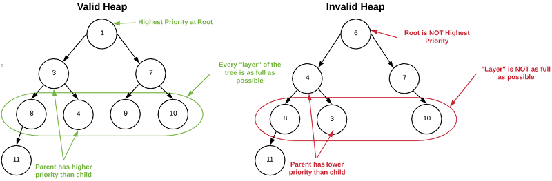
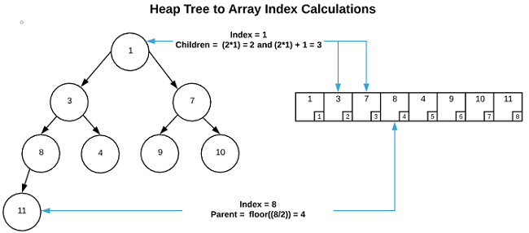

# Data Structures
Data Structures are the cornerstone of efficient algorithms. They organize data
so that it is quickly and usefully accessible. Most mainstream languages come
equipped with pre-configured archetypes of all the standard data structures.
With the exception of C programmers, it's highly unlikely that the average coder
will every have to implement any data structures from scratch. However, this
does not preclude the need for understanding how they work. Knowing the runtime
characteristics and supported operations is absolutely requite to being able to
complete common programming tasks.

Choosing the right data structure is all about finding the most efficient
implementation that supports all the required operations and nothing more.
Superfluous operations typically equate to inflated run times and memory
consumption. This is so important that it has a name:

**Principal of Parsimony**: Choose the simplest data structure that supports all
the operations required by your application.

This section should equip aspiring programmers (or act as a reminder to
accomplished programmers) with the knowledge required to use data structures
effectively.

## Stack (Last-In-First-Out)
At a base level, a stack is simply a [list data
structure](../list_data_structures) with a constrained set of methods that make
it uniquely suited for some programming tasks. These methods are `push`, which
adds an item to the head of the list and `pop` which removes and returns the
item in the head position. The most common analogy is a stack of plates. You
place a plate on top of the stack, and you must retrieve the last plate placed
on the stack before you can access plates below it. In software parlance, a
stack is known as a *Last-in-First-Out* data structure because the last item
pushed on the stack is the first one out (clever, huh?).

Typically, a [Linked List](../list_data_structures/README.md#linked-lists) is
used when implementing a stack. However, an
[Array](../list_data_structures/README.md#arrays) is also a viable option. The
reader is encouraged to examine the accompanying code to get a better
understanding of how stacks work.

### Asymptotic Time Complexity
* Push:  "O(1)")
* Pop:  "O(1)")

### Pseudo Code
```
push:
    Adds an item to the head of the list

pop:
    Remove item from the head the list and returns it

peek:
    Return item from the head without removing it from the list
```

### Applications
* Memory Management: Operating systems use a stack for managing memory.
* Backtracking: Keep track of tasks so they can be undone if necessary. Think of
    what happens when you press `ctrl+z` while using MS Word, or `u` when using
    VIM.
* Graph [Depth First Search](../graph_search/README.md#depth-first-search-dfs)

## Queue (First-In-First-Out)
Just like a stack, a queue is simply a [list data
structure](../list_data_structures) with a constrained set of methods that make
it uniquely suited for some programming tasks. These methods are `enqueue`,
which adds an item to the end of the list and `dequeue` which removes and
returns the item in the head position. Think of a queue like a line to get into
a night club. New people are added to the end of the queue and people are
removed from the front of the queue as they are let in to enjoy a night of
dancing. In software parlance, a queue is known as a *First-in-First-Out* data
structure because the first item added to the queue is the first one out
(clever, huh?).

Typically, a [Linked List](../list_data_structures/README.md#linked-lists) is
used when implementing a queue. However, an
[Array](../list_data_structures/README.md#arrays) is also a viable option. The
reader is encouraged to examine the accompanying code to get a better
understanding of how queues work.

### Asymptotic Time Complexity
* Enqueue:  "O(1)")
* Dequeue:  "O(1)")

### Pseudo Code
```
enqueue:
    Add item to the end of the list

dequeue:
    Remove item from the head of the list and returns it

peek:
    Return item from the head without removing it from the list
```

### Applications
* Job Scheduling: A print driver maintains a queue of print jobs and sends them
    to the printer as it is available.
* Buffering: Streaming video and audio applications typically maintain a buffer
    of content to compensate for erratic connections.
* CPU Scheduling: A thread can place a job on a queue to be picked by another
    thread. *Caveat*: This requires the queue to be synchronized.
    Multi-threading concepts are covered in other sections.

## Priority Queue
Another type of queue is a priority queue. These behave very similarly to
standard queues with the exception that rather than being *First-In-First-Out*,
the order in which items are removed is determined by a predefined priority
function. There are multiple ways to implement this. A somewhat slow example
using [Linked Lists](../list_data_structures/README.md#linked-list) is shown
below. **It is unlikely that anyone would use such an implementation in a
production scenario; however, it is a useful learning tool** for understanding
how Priority Queues work at a conceptual level.

### Asymptotic Time Complexity
* Insert:  "O(n)")
* Extract:  "O(1)")
* Find:  "O(1)")

### Pseudo Code

```
priority_function:
    item1
    item2

    if item1 and item2 are equal
        return 0
    if item1 should be before item2
        return 1
    if item1 should be after item2
        return -1

insert:
    new_item

    for each item in the list:
        if prority_function(new_item, item) = 1
            insert new_item before item
            break out of loop

extract:
    Remove item from the head of the list and returns it

find:
    Return item from the head without removing it from the list
```

## Heap
Some sources claim that heaps and priority queues are the same thing. Others
indicate that a priority queue is an abstract data type and a heap is an
implementation of a priority queue. In reality, the distinction isn't that
important. Heaps are a great way to create a priority queue with methods that
have excellent asymptotic time complexity and minimal memory overhead.

Heaps are unique in that they are logically *similar* to [Binary
Trees](../list_data_structures/README.md#binary-trees) but are stored in memory
as [Arrays](../list_data_structures/README.md#array). First, consider a heap as
a tree.

Logically, a heap is a tree that maintains the following properties:
1. The node with the highest priority resides at the root
1. Every node has 2 children at most
1. Every layer of the tree is as full as possible
1. Every node has an equal or higher priority than it's children

There are many valid ways to organize data in a tree while maintaining these
properties. This concept is best understood visually. See the image below.



A standard binary tree locates it's children via pointers stored on each node.
Conversely, a heap stores all nodes in an array and locates it's ancestry via
simple index calculations. Considering a *non-zero based index* array and `i` is
the index of the node in question, the following formulas are used to calculate
the index of parent and children nodes in the array.

* Parent = 
* Left Child = 
* Right Child = 

This is a difficult concept to understand without a visual. Please see the image
below.



### Asymptotic Time Complexity
* Insert: )
* Extract: )
* Find:  "O(1)")

### Pseudo Code

```
priority_function:
    item1
    item2

    if item1 and item2 are equal
        return 0
    if item1 should be before item2
        return 1
    if item1 should be after item2
        return -1

insert:
    heap_data = array containing heap items
    n = number of items in the array
    new_item = item to insert into the heap

    heap_data[n] = new_item
    bubble_up_item = new_item
    n = n + 1

    while bubble_up_item does NOT equal the first item in the tree:
        parent = bubble_up_item's parent

        if (priority_function(bubble_up_item, parent) <= 0:
            exit loop and stop processing
        
        swap bubble_up_item and parent in heap_data
        bubble_up_item = parent

extract:
    heap_data = array containing heap items
    n = number of items in the array

    return_item = heap_data[0]
    n = n - 1

    move last item in the array to the first item in the array
    bubble_down_item = first item in array

    while bubble_down_item has children:
        child = child with the greatest priority

        if (priority_function(bubble_up_item, parent) >= 0:
            exit loop and stop processing

        swap child and bubble_down_item in heap_data
        bubble_down_item = child

peek:
    Return item at heap_data[0] without removing it from the array
```
