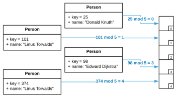
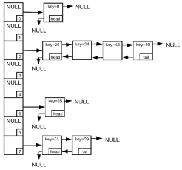

# Data Structures
Data Structures are the cornerstone of efficient algorithms. They organize data
so that it is quickly and usefully accessible. Most mainstream languages come
equipped with pre-configured archetypes of all the standard data structures.
With the exception of C programmers, it's highly unlikely that the average coder
will every have to implement any data structures from scratch. However, this
does not preclude the need for understanding how they work. Knowing the runtime
characteristics and supported operations is absolutely requisite to being able
to complete common programming tasks.

Choosing the right data structure is all about finding the most efficient
implementation that supports all the required operations and nothing more.
Superfluous operations typically equate to needless complexity, inflated run
times and memory consumption. This is so important that it has a name:

**Principal of Parsimony**: Choose the simplest data structure that supports all
the operations required by your application.

This section should equip aspiring programmers (or act as a reminder to
accomplished programmers) with the knowledge required to use data structures
effectively.

## Stack (Last-In-First-Out)
At a base level, a stack is simply a [list data
structure](../list_data_structures) with a constrained set of methods that make
it uniquely suited for some programming tasks. These methods are `push`, which
adds an item to the head of the list and `pop` which removes and returns the
item in the head position. The most common analogy is a stack of plates. You
place a plate on top of the stack, and you must retrieve the last plate placed
on the stack before you can access plates below it. In software parlance, a
stack is known as a *Last-in-First-Out* data structure because the last item
pushed on the stack is the first one out (clever, huh?).

Typically, a [Linked List](../list_data_structures/README.md#linked-lists) is
used when implementing a stack. However, an
[Array](../list_data_structures/README.md#arrays) is also a viable option. The
reader is encouraged to examine the accompanying code to get a better
understanding of how stacks work.

### Asymptotic Time Complexity
* Push:  "O(1)")
* Pop:  "O(1)")

### Pseudo Code
```
push:
    Adds an item to the head of the list

pop:
    Remove item from the head the list and returns it

peek:
    Return item from the head without removing it from the list
```

### Applications
* Memory Management: Operating systems use a stack for managing memory.
* Backtracking: Keep track of tasks so they can be undone if necessary. Think of
    what happens when you press `ctrl+z` while using MS Word, or `u` when using
    VIM.
* Graph [Depth First Search](../graph_search/README.md#depth-first-search-dfs)

## Queue (First-In-First-Out)
Just like a stack, a queue is simply a [list data
structure](../list_data_structures) with a constrained set of methods that make
it uniquely suited for some programming tasks. These methods are `enqueue`,
which adds an item to the end of the list and `dequeue` which removes and
returns the item in the head position. Think of a queue like a line to get into
a night club. New people are added to the end of the queue and people are
removed from the front of the queue as they are let in to enjoy a night of
dancing. In software parlance, a queue is known as a *First-in-First-Out* data
structure because the first item added to the queue is the first one out
(clever, huh?).

Typically, a [Linked List](../list_data_structures/README.md#linked-lists) is
used when implementing a queue. However, an
[Array](../list_data_structures/README.md#arrays) is also a viable option. The
reader is encouraged to examine the accompanying code to get a better
understanding of how queues work.

### Asymptotic Time Complexity
* Enqueue:  "O(1)")
* Dequeue:  "O(1)")

### Pseudo Code
```
enqueue:
    Add item to the end of the list

dequeue:
    Remove item from the head of the list and returns it

peek:
    Return item from the head without removing it from the list
```

### Applications
* Job Scheduling: A print driver maintains a queue of print jobs and sends them
    to the printer as it is available.
* Buffering: Streaming video and audio applications typically maintain a buffer
    of content to compensate for erratic connections.
* CPU Scheduling: A thread can place a job on a queue to be picked by another
    thread. *Caveat*: This requires the queue to be synchronized.
    Multi-threading concepts are covered in other sections.

## Priority Queue
Another type of queue is a priority queue. These behave very similarly to
standard queues with the exception that rather than being *First-In-First-Out*,
the order in which items are removed is determined by a predefined priority
function. There are multiple ways to implement this. A somewhat slow example
using [Linked Lists](../list_data_structures/README.md#linked-list) is shown
below. **It is unlikely that anyone would use such an implementation in a
production scenario; however, it is a useful learning tool** for understanding
how Priority Queues work at a conceptual level.

### Asymptotic Time Complexity
* Insert:  "O(n)")
* Extract:  "O(1)")
* Find:  "O(1)")

### Pseudo Code

```
priority_function:
    item1
    item2

    if item1 and item2 are equal
        return 0
    if item1 should be before item2
        return 1
    if item1 should be after item2
        return -1

insert:
    new_item

    for each item in the list:
        if prority_function(new_item, item) = 1
            insert new_item before item
            break out of loop

extract:
    Remove item from the head of the list and returns it

find:
    Return item from the head without removing it from the list
```

## Heap
Some sources claim that heaps and priority queues are the same thing. Others
indicate that a priority queue is an abstract data type and a heap is an
implementation of a priority queue. In reality, the distinction isn't that
important. Heaps are a great way to create a priority queue with methods that
have excellent asymptotic time complexity and minimal memory overhead.

Heaps are unique in that they are logically *similar* to [Binary
Trees](../list_data_structures/README.md#binary-trees) but are stored in memory
as [Arrays](../list_data_structures/README.md#array). First, consider a heap as
a tree.

Logically, a heap is a tree that maintains the following properties:
1. The node with the highest priority resides at the root
1. Every node has 2 children at most
1. Every layer of the tree is as full as possible
1. Every node has an equal or higher priority than it's children

There are many valid ways to organize data in a tree while maintaining these
properties. This concept is best understood visually. See the image below.


A standard [Binary Tree](../list_data_structures/README.md#binary-trees) locates
it's children via pointers stored on each node.  Conversely, a heap stores all
nodes in an array and locates it's ancestry via simple index calculations.
Considering a *non-zero based index* array and `i` is the index of the node in
question, the following formulas are used to calculate the index of parent and
children nodes in the array.

* Parent = 
* Left Child = 
* Right Child = 

This is a difficult concept to understand without a visual. Please see the image
below.


There are actually many different heap variations. Presented above is a *Binary
Heap* which is one of the simplest. Other types of heaps vary in run times and
internal details, but they all operate similarly. An in-depth exploration of
heap implementations falls outside of scope. It would be easy to write an entire
book on the subject. To demonstrate the breadth of the topic, below is an
incomplete list of heap variants.

* 2-3 heap
* B-heap
* Beap
* Binomial heap
* Brodal queue
* d-ary heap
* Fibonacci heap
* Leaf heap
* Leftist heap
* Pairing heap
* Radix heap
* Randomized meldable heap
* Skew heap
* Soft heap
* Ternary heap
* Treap
* Weak heap

##### Warning
> This section gives an account of binary heaps only. In the event that the
> reader has a need to implement a heap for a mission critical application, it's
> highly recommended they research the topic much more thoroughly. There are
> many heap variants that may or may not be better suited to specialized
> scenarios.

### Asymptotic Time Complexity
* Insert: )
* Extract: )
* Find:  "O(1)")

### Pseudo Code

```
priority_function:
    item1
    item2

    if item1 and item2 are equal
        return 0
    if item1 should be before item2
        return 1
    if item1 should be after item2
        return -1

insert:
    heap_data = array containing heap items
    n = number of items in the array
    new_item = item to insert into the heap

    heap_data[n] = new_item
    bubble_up_item = new_item
    n = n + 1

    while bubble_up_item does NOT equal the first item in the tree:
        parent = bubble_up_item's parent

        if (priority_function(bubble_up_item, parent) <= 0:
            exit loop and stop processing
        
        swap bubble_up_item and parent in heap_data
        bubble_up_item = parent

extract:
    heap_data = array containing heap items
    n = number of items in the array

    return_item = heap_data[0]
    n = n - 1

    move last item in the array to the first item in the array
    bubble_down_item = first item in array

    while bubble_down_item has children:
        child = child with the greatest priority

        if (priority_function(bubble_up_item, parent) >= 0:
            exit loop and stop processing

        swap child and bubble_down_item in heap_data
        bubble_down_item = child

peek:
    Return item at heap_data[0] without removing it from the array
```

## Hash Tables
*Hash tables* (aka *Hash Map* or *Dictionary*) are one of the most commonly used
data structures. While Hash Table is a very appropriate name considering their
internal workings, Dictionary is a more suitable characterization considering
the way they work conceptually. Just like a physical dictionary stores
definitions retrievable via a word. Hash Tables store objects that are
retrievable via an arbitrary key. What's extraordinary is that hash table
insertions, deletions, and searches are constant time operations (under
reasonable assumptions). Many computer science applications can be reduced to
repeated lookups; therefore, the ability to perform a search in constant time is
invaluable. Consider a Hash Table of people objects using name as a key as
depicted below.

```
people["Donald Knuth"] = { new person object };
people["Edward Dijkstra"] = { new person object };

person Donald = people["Donald Knuth"];
```

Most mainstream languages have built-in hash table implementations that utilize
the array-ese syntax shown above. C however, has no default implementation so
the syntax is anomalous by comparison. Please be aware of this while examining
the source code.

Consider a standard [Array](../list_data_structures/README.md#arrays). If the
index of any item is known, it can be inserted, deleted, or retrieved in
constant time via direct addressing. The innovation of hash tables is using a
*hash function* to convert an arbitrary key into an array index which can then
be used for direct addressing. The pseudo code below is a naively simply hash
function that converts an integer key to an index.  An integer key is used for
the sake of simplicity. Other objects, such as strings are also a valid keys. To
use a string, it must be first converted to an integer. Languages such as Java
and C# provide a hash code method that does this automatically. Converting a
string to an integer in C is fairly trivial. Search for djb2 or sbdm for
examples.

<pre>
hash:
    key: integer key value
    max_index: maximum index to generate; hash table array size

    return key mod<sup>*</sup> max_index
</pre>
> <sup>*</sup> mod divides the first number by the second number and returns the
> remainder. For instance,
>  because
>  is 5 with a remainder of 1.

This is by no means a valid hash function; however, it's simple enough to serve
as a learning tool and will be used as a reference for the bulk of this section.
Depicted below is a hash table of Person objects that has five available slots
commonly referred to as *buckets*. Regardless of the nomenclature, they are
nothing more than items in an array. Each Person object has an arbitrary key
value that is used to insert and retrieve items from the hash table. In essence,
this is how all hash tables work.

#### Simple Hash Table


Although the above conceptually works, there are some fatal shortcomings. For
instance, what happens when inserting a Person with a key of 33. Because
 is 3, Edward Dijkstra
would be overwritten. This is known as a *collision*. Collisions occur anytime a
hash function generates the same index for two distinct keys. One option is to
simply make the array size larger to reduce collisions. For instance, if the
array size is 17, Edward Dijkstra is then changed to index 13
() and the new
item to index 16
(). While this is
better, it is certainly not adequate. Inserting a key of 81
() will cause a
collision with Edward Dijkstra's new index. The question becomes, "is it
possible to create a hash function that is immune to collisions".

Unfortunately, the answer to the question above is an unequivocal no. The crux
of the issue can be summarized with a single concept: *the Pigeonhole
Principal*.  Given `x` pigeonholes and `x + 1` pigeons, it's impossible to place
all the pigeons in pigeonholes without placing two pigeons in a single hole. How
does this relate to hash tables? Suppose there are 100 items stored in a hash
table using a ten character string as the key. There are
 possible keys. In order
for a hash function to produce a unique array index for every possible key, the
array would need to be equally sized. Even if the hash table is stored on a
industrial grade super computer with virtually unlimited resources, it would be
beyond wasteful to use that much memory to store 100 items. This creates a bit
of a quandary because it's theoretically impossible to generate unique indices
from keys when the total possible number of keys is larger than the number of
possible indices.

The problem is actually even worse than outlined in the previous paragraph. As
is already substantiated, collisions are unavoidable. Just how unavoidable is
yet to be established. The concept is best illustrated by the *Birthday Paradox*
(technically not a paradox, more of a failing in human intuition). Suppose there
are 367 randomly chosen people in a room. Because there are 365 days in a year,
by the pigeonhole principal, there is a 100% probability that two people share
the same birthday. This is intuitive; however, the reality that if there are 70
people in the room there is a 99.9% probability of a birthday collision is not
so intuitive. In fact, with just 23 people in the room, there is a 50%
probability of a collision. The reader is spared the somewhat mundane math
behind these facts; however, in the event of unbridled curiosity typing
"birthday paradox" into a search engine should satiate.  The salient point is
that if there is a hash table with 365 possible keys and 23 available storage
locations, there is a 50% probability of a collision. It is hopefully obvious
that collisions are unavoidable. The only option is to deal with duplicate
indices.

One common method for dealing with collisions is *chaining*<sup>1</sup>, which
is storing a [Linked List](../list_data_structures/README.md#linked-lists) in
each hash table array item. The image below depicts a hash table array with
eight available slots and eight stored items. There were four collisions at
index two, so four items are stored in that bucket. Locating an item in the hash
table involves generating a hash, locating the desired linked list, and
searching it.

#### Chaining


The challenge of chaining (and all collision resolution techniques) is that
performance degrades as the number of collisions increase. While collisions are
a certainty, two techniques for minimizing them are managing *load* and using an
optimal hash function.

#### Load
Hash Table load is the ratio of the count of stored objects to the length of the
array. In the chaining image above, the load is 1 because there are 8 stored
objects and the array has a length of 8. A rule of thumb is to keep the load
below 0.7.  In practice this means resizing the array and rehashing all the
items when load gets too high. Obviously, this is an expensive operation that
should be avoided when possible. Choosing the starting size of the array is
critical.

#### Optimal Hash Functions
The quality of the hash algorithm is a major contributing factor to the quantity
of collisions. An optimal hash function has two primary attributes: exceptional
run time performance and the ability to generate indices that are evenly
distributed across the possible values (commonly referred to *simple uniform
hashing*). The naive hash function defined above possesses the first attribute
but fails miserably at the second. Imagine if the hash table were storing
widgets objects with the price as the key. If the array length is 100, every
price that ends with 99 will be stored at the same index.  It's fairly easy to
fabricate many data sets that will cause this particular hash function to
generate a single index. The question now is, "is it possible to create a hash
function that will always generate evenly distributed indices?".

The unfortunate answer to the question above is no. While it's true that some
hash functions are much better than others, with some advance knowledge of its'
inner workings it is possible to fabricate any number of *pathological* data
sets for any hash function. A pathological data set is a collection of key
values that is engineered to prevent even distribution of data. What this means
is that any user consuming a hash table can produce a set of keys that forces
all items into a single bucket effectively changing the run time from constant
to linear. This will enable malicious actors to mount denial of service or
similar attacks. Luckily, there is some recourse by using *universal hashing*.

#### Universal Hashing
Universal hashing eliminates the risk of pathological data sets by randomly
choosing a hash function independently from the stored keys. Each execution of
the algorithm chooses a different hash function, even for the same input. This
virtually eliminates the possibility that any one data set can create a single
index for all keys. Maintaining several hash functions, randomly assigning them,
and tracking which keys used which hash function adds a considerable amount of
complexity and overhead. Carefully ensure it is required before attempting to
implement it.

#### Hash Table Design
The opening paragraph in this section stated: "What's extraordinary is that hash
table insertions, deletions, and searches are constant time operations (**under
reasonable assumptions**)". Those reasonable assumptions are 1) the keys are not
pathological and 2) the hash function is capable of simple uniform hashing.
Failing either of these two assumptions results in problems that are rather
difficult to troubleshoot. However, a correctly implemented hash table has
unparalleled performance. The reward is well worth the risk.

##### Warning
> The reader may (and probably should) be feeling some anxiety about
> implementing a hash table at this point. For mission critical applications,
> it's highly advisable to use a well known implementation. If that isn't an
> option, the recommendation is to further research the topic and scrutinize the
> code of known experts. The intent of this section is to make the reader
> understand how hash tables work; it does not represent the state-of-the-art in
> hash table design.  **The remainder of this section details how to design a
> hash table that works well for most non-critical applications.**

There are three important decisions when designing a hash table.

1. How to generate hash codes from keys
1. How to compress hash codes into a number between 0 and the count of buckets
1. How many buckets (the length of the array). This decision has implications on
   maximum load and resizing.

The first decision is likely the most complex. Recall that a good hashing
function is both performant and capable of simple uniform hashing. There are
many freely available hashing algorithms that have been heavily vetted (e.g.
FarmHash, MurmurHash3, SpookyHash). Therefore; it really doesn't make sense to
"roll your own". One important note is that the design considerations for a
cryptographic hash are considerably more complex. The complexity is well
warranted but adds non-trivial performance overhead that is ill-suited for hash
tables. Non-cryptographic hash functions are the best option.

The second decisions has some implications on the third. A hash is typically a
large integer and translating it into an array index has implications on the
distribution of the data. The most common reduction method is known as the
*division method*. The division method takes the remainder of dividing the hash
(`h`) by the number of available buckets (`m`): . This works well is many
cases. However, one has to carefully consider the value of `m`. Any common
factors between the input keys and `m` will result in non-uniform distribution
of data. The best way to mitigate this risk to ensure that `m` has as few
factors as possible; therefore, prime numbers are ideal.

The *multiplication method* is another means of compressing a hash into an array
index. It is more complex but has the advantage that the number of buckets is
not critical to the distribution of data. The formula for the multiplication
method is &space;\right&space;\rfloor)
where `A` is a constant, `h` is the hash value, and `m` is the number of
buckets. The value of `A` can be anything; however, the great Donald Knuth
suggests that a good general purpose value is
. The reasons for
this are out of scope. The fact that it comes from Donald Knuth should be enough
to convince anyone. However, please refer to *The Art of Computer Programming
v.3 Sorting and Searching* for more detail if so desired.  As an added bonus,
with a bit of ingenuity one can optimize the implementation of the
multiplication method for efficiency on most machine architectures.

The final decision is the size of the hash table array. Managing the
[load](#load) of the hash table is very important and avoiding resizing is
equally critical. Choose an initial size that will keep the load under 0.7 and
also avoid resizing.

In conclusion, making intelligent decisions for the three most important design
considerations will ensure a performant hash table. Unfortunately, there is a
great deal of nuance involved that is easy to overlook. Hash tables should not
be implemented hastily. Properly implemented, hash tables allow for insertion,
deletion, and search in constant time.

### Asymptotic Time Complexity
* Insert:  "O(1)")
* Delete:  "O(1)")
* Find:  "O(1)")

Assuming non-pathological data and simple uniform hashing

### Applications
* De-Duplication: Inserting items into a hash table automatically removes
    duplicates by nature of the way they work. This has many application such as
    tracking unique visitors to a web site.
* Symbol Tables: Compilers commonly track symbols using hash tables.

## Footnotes
> <sup>1</sup> There are other collision resolution strategies such as *open
> addressing*.  However, this project only considers chaining. Other options are
> bound by the same constraints and the concepts are sufficiently transferable.
