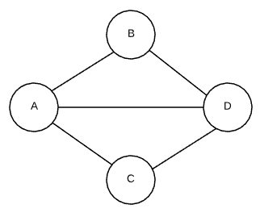
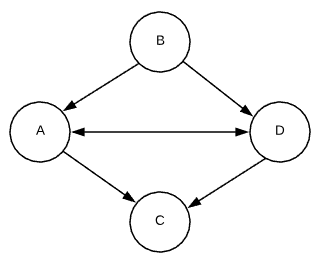
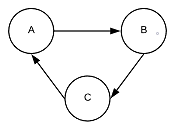
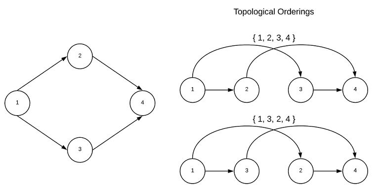
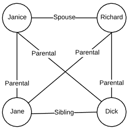
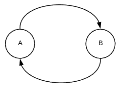
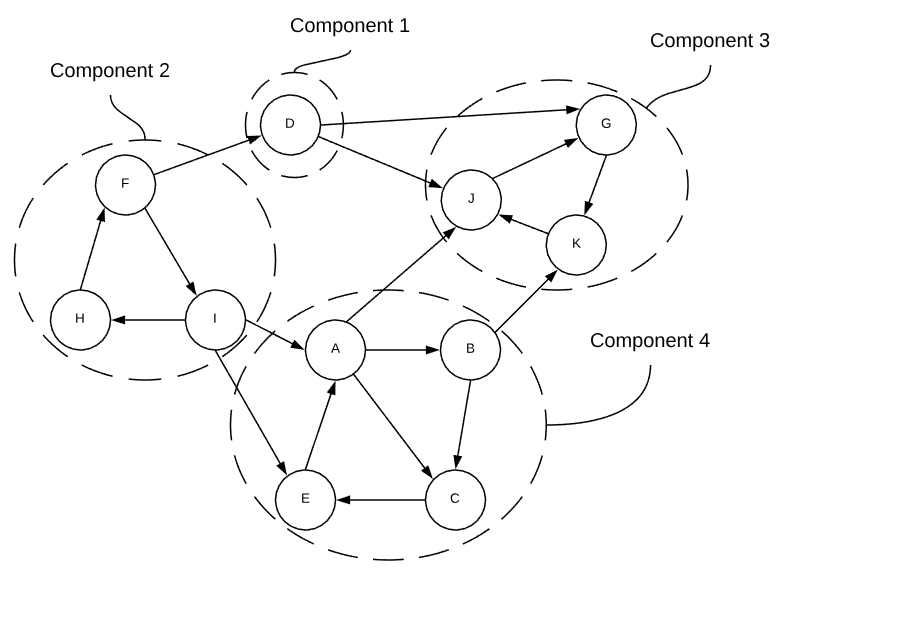
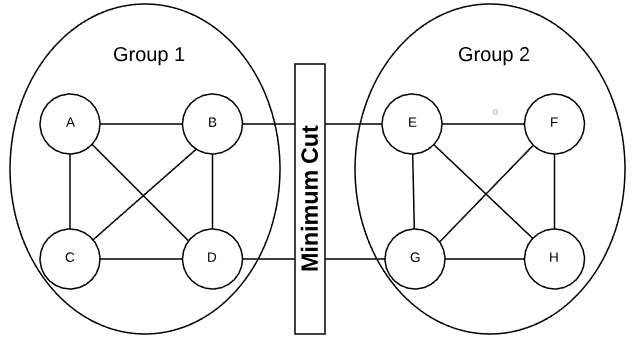
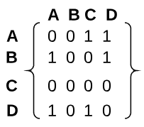

# Graph Concepts
#graph

This project contains many graph algorithms. This section provides a brief
overview of graph concepts. Consider comprehension of this material a
pre-requisite for graph algorithms.

## Graphs
Graphs represent pair wise relationships among objects. In graph jargon, the
objects are known as either *vertices* or *nodes*. The relationship between the
vertices are *edges*. Vertices that are connected via an edge are said to be
*adjacent* to each other.  To make the concept a bit more concrete, consider
modeling one's family as a graph. The people in the family would be vertices,
and the relationships between them (mother, daughter, father, brother, etc..)
would be edges. Edges are typically denoted by a pair known as the *endpoints*.
If Dick is Jane's brother, the relationship is denoted as (Dick, Jane). The
set of all vertices is denoted as `V` and `E` denotes the set of all edges. The
*degree* of a vertex is the number of edges connected to it.

There are two types of graphs: *undirected* and *directed*. The edges of an
undirected graph indicates a bi-directional relationship. (A, B) and (B, A) are
essentially the same.  See the example below.

#### Undirected Graph


* `V`: A, B, C, D
* `E`: (A, B), (A, C), (A, D), (B, D), (C, D)

Conversely, the edges of a directed graph denote the direction of the
relationship. (A, C) indicates that A has a connection to C, but that does not
imply that the reverse is also true. Continuing on with the family graph
example, the brother edge (Dick, Jane) indicates that Dick is Jane's brother.
However, Jane is not Dick's brother. The end point of the relationship is known
as the *head* while the origin is referred to as the *tail*. Some sources also
refer to directed edges as *arcs*. See the example below.

#### Directed Graph



* `V`: A, B, C, D
* `E`: (A, C), (A, D), (B, A), (B, D), (D, A), (D, C)

### Cycle
An important concept related to directed graphs is *cycle*s. A cycle occurs when
there exists a vertex that has a path that leads back to itself. An example is
shown below.



### Topological Ordering
A graph with no cycles is said to *acyclic*. A *directed acyclic* graph is
particularly interesting because such graphs have a least one (usually many)
*topological ordering*. A graph with a cycle has no topological ordering. While
the goal of this project is to abstain from recondite mathematical definitions,
this concept is much easier to understand in such terms. A topological sort is
an ordering of vertices
 in such a
way, that if there exists an edge with a tail of
 and a head of
, then
 comes before
. It's a ordering of vertices
in which the directed edges of the graph always move forward in the ordering.
Consider a graph in which the vertices represent tasks and directed edges
represent precedence constraints. The topological orderings are acceptable
sequences in which to complete the tasks. This is depicted graphically below.



Every directed acyclic graph has a *source vertex*, that is a vertex with no
incoming edges. Additionally, there must exists a vertex with no outgoing edges
known as the *sink vertex*.  The interested reader is encouraged to contemplate
why this is true...

### Edge Weights
Edges can also have weights associated with them. Weighting assigns a cost to
each edge. Weighting can be modeled in almost any way imaginable. In a network,
this weight could be connection latency. Going back to the family graph example.
Each relationship edge could have an intimacy weight.  For instance, a spousal
relationship may have a weight of 5 whereas a sibling relationship may have a
weight of 3. See the image below. In this graph, the (Janice, Richard) edge has
a higher weight than the (Jane, Dick) edge.



### Parallel Edges
A term commonly used in graph applications is *parallel edge*. A parallel edge
is two or more edges related to the same two vertices. For instance, (A, B) and
(B, A) are parallel edges. The edges in the graphic below are parallel edges.



### Connected Components (Undirected)
Portions of a Graph are said to be *connected* when there is no way to separate
the vertices without edges crossing between the parts. A common task is to
identify all connected components of a graph.  Consider the graph below, it is
made up of three connected components.


### Strongly Connected Components (Directed)
Deciphering connected components in a directed graph is a bit more difficult
than it is in undirected graphs. A *strongly connected component* is a
subsection of a directed graph in which there is a directed path from every
vertex to every other vertex. The rather convoluted graph below demonstrates the
concept.



If each strongly connected component is treated as a single node, the graph
becomes a directed acyclic graph. Just like nodes in a directed graph, a
strongly connected components with no incoming edges is known as a *source* and
one without any outgoing edges is known as a *sink*.

### Minimum Cut
The *minimum cut* is the grouping of vertices into two non-empty groups having
the fewest number of crossing edges. Consider the graph in the graphic below.
There is no other way of dividing the vertices that would result in fewer
crossing edges.



In an undirected graph, a crossing edge is considered any edge that has an end
point in both groups. A crossing edge in a directed graph is when an edge has a
tail in group 1 and a head in group 2.  The *minimum cut size* is the number of
crossing edges. Logically, the size cannot exceed the minimum degree of the
graph.


### Graph Size

In order to accurately predict the performance of graph algorithms, it's
important to have common terminology for expressing the size of a graph. The
size is made up of two components: the number of vertices and the number of
edges. By convention, `n` denotes the number of vertices and `m` denotes the
number of edges.

```
n = |V|
m = |E|
```

Graph density is important when determining the best way to represent a graph in
memory. Consider a graph with no parallel edges, the lower bound of `m` is
. The upper bound of `m` is
}{2}).

Graphs conforming the lower bound are known as *tree*s. A *complete* graph has
the maximum number of edges with none of them being parallel.

Roughly defined, a *sparse* graph is closer to the lower bound and a *dense*
graph is closer to the upper bound.

### Graph Representations

There are several ways of representing a graph. Two of the most common are
adjacency matrices and adjacency lists.  The choice of which to use depends on
graph density (sparse vs dense) as well as the desired graph operations.

For both cases, consider the graph below.


#### Adjacency Matrix
An adjacency matrix depicts vertices as indices across the top and side of a
matrix. A one at the intersection of two vertices indicates a connected edge
while a zero indicates no connection. The associated adjacency matrix for the
graph in question is shown below.

 

The amount of space required to store an adjacency matrix is
.

#### Adjacency List

There are several different ways to create an adjacency list. However, the
general concept is to have four components:

* Array of Vertices
* Array of Edges
* Edges have two pointers, one for the tail and one for the head
* Vertices have one pointer for each of its edges

One common adjacency list representation is an array of linked lists. Each item
in the array is a vertex. Each edge is represented as a link.

```
Vertices
[
    { A -> C -> D -> NULL }
    { B -> A -> D -> NULL }
    { C -> NULL }
    { D -> C -> A -> NULL }
]
```

Depending on the application's needs, keeping the vertices and edges in separate
arrays may be more appropriate as show below.

```
Vertices                Edges
[                       [
    { A, [0, 1] }           [0]{ A, C }
    { B, [2, 3] }           [1]{ A, D }
    { C, NULL }             [2]{ B, A }
    { D, [4, 5] }           [3]{ B, D }
]                           [4]{ D, C }
                            [5]{ D, A }
                        ]
```

Adjacency lists have lower space requirements than matrices. Additionally, they
are optimized for graph search algorithms.

### Common Uses 

There are virtually countless applications for graphs. Below are just a few
common uses.

* Road Networks (driving directions) - roads are vertices are intersections are
    edges
* Networks - machines are vertices and connections are edges
* Social Networks - people are vertices and relationships are edges
* Web - pages are the vertices and hyperlinks are the edges
* Genealogy - people are the vertices and family relationships are the edges
* Academic Plans: Courses are vertices and prerequisites are directed edges
