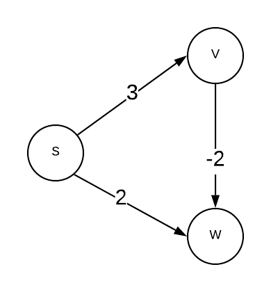

# Greedy Algorithms
Common solution to scheduling problems: how should a shared resource be
allocated
- Iteratively make myopic irrevocable decisions
- [Dijkstra's](../shortest_path/README.md#dijkstras-naive) shortest path is an
    example of a popular greedy algorithm

### Pros
- Easy to apply
- Easy run time analysis

### Cons
- Difficult to establish correctness
- Despite intuition, most are NOT correct and heuristics are often misleading

Example: 
Dijkstra's shortest path algorithm with negative edge lengths. Consider the
graph below. Calculate the shortest path from s->w.

Dijkstra's algorithm will compute 2 (s->w) but 1 (s->v->w) is the correct
answer. 

Correctness Proofs
- Induction
- Exchange argument
- Whatever works

The caching problem
- Von Neumann architecture memory hierarchy
- Bélády's theorem (1960s) indicates that a natural greedy algorithm (furthest
    in the future) is an optimal algorithm for the caching problem.
- The optimal caching algorithm is a greedy algorithm - furthest in the future
    algorithm
    * this is unimplementable as it would require clairvoyance; however, it
        serves as a guideline for practical algorithms 
    * informs that Least Recently Used (LRU) (closest you can get to furthest in
        the future) algorithm - gold standard for cache algorithms
    * serves as an idealized benchmark

# Dynamic Programming
- Similar to divide and conquer problem, except sub-problems may "overlap". The
    solution to sub-problems is stored in a table.
- Optimization Problem - there are many potential solutions. Each solution has
    an associated value and the goal is to find a optimal (maximum or minimum)
    value. There are many optimal solutions - the goal is find any one of them.

Steps in dynamic programming algorithm
1. Define the structure of an optimal solution
1. Recursively define the value of an optimal solution
1. Compute the value of an optimal solution
1. Construct optimal solution from the computed information
