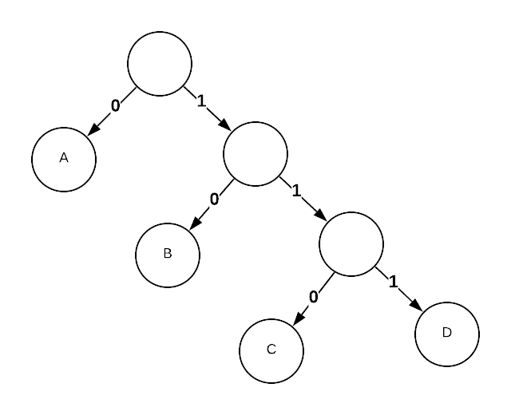

# Huffman Codes
Popular method of lossless compression.

Concepts
- Fixed length codes
    * Each item in the code list has the same number of characters

        | Symbol| Code  |
        |-------|-------|
        | A     | 00    |
        | B     | 01    |
        | C     | 10    |
        | D     | 11    |
    * The code can be interrupted because each code is the same length
    * This will always use 2 bits per symbol
- Variable length codes
    * Each code can have a different length
    * If shorter codes are used for the most frequently used symbols, the
        resulting message is shorter

        | Symbol| Code  |
        |-------|-------|
        | A     | 0     |
        | B     | 01    |
        | C     | 10    |
        | D     | 1     |
    * The problem is that the code 001 can be interrupted as AB or AAD
- Prefix-Free codes
    * No symbol is a prefix of another symbol

        | Symbol| Code  |
        |-------|-------|
        | A     | 0     |
        | B     | 10    |
        | C     | 110   |
        | D     | 111   |
     * Suppose the following distribution of symbols

        | Symbol| Freq  |
        |-------|-------|
        | A     | 60%   |
        | B     | 25%   |
        | C     | 10%   |
        | D     | 5%    |
    * The average number of bits per symbol = 1*.6 + 2*.25 + 3*.1 _ 3*.05 = 1.55

As is shown above, the optimal code varies depending on symbol distribution. So,
the problem becomes given a particular group of symbols how can we define the
optimal prefix-free codes?

## Real World Applications
- Geneticist calculate the frequencies of As, Cs, Gs, and Ts in human DNA to
    generate an efficient code
- MP3 encoding computes symbol frequencies before compression

A prefix-free code can be represented by a binary tree

## Asymptotic Complexity
)

