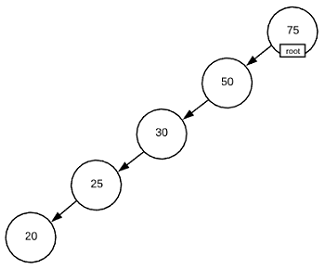

# List Data Structures
A *list* (aka *collection* or *container*) is a logical grouping of data items
into a single unit. Lists enable operations such as inserting new items,
searching through existing items, deleting items, and enumerating existing
items. There are several common list data structures and different structures
have different capabilities/performance characteristics.

In the author's humble opinion, comprehension of list data structures is the
first concept that an aspiring programmer should master because list
manipulation is the single most common programming task. So common in fact that
all mainstream languages have builtin list abstractions.  For instance, LISP,
which stands for LISt Processor, is designed entirely around the concept.  C#
has the `IEnumerable` interface, Java has the `Iterable` interface, Python has
`list`. There are many more examples but there is no need to belabor the point.

List data structures have differing strengths, weaknesses, and capabilities.
Therefore, it's important to fully understand list abstractions in order to
choose the correct one. Sometimes choosing the right one is easy because a
particular utility is required. Contrarily, it's possible to choose one that
will meet the software requirements but have a prodigious negative impact on
performance.

This section examines four list data structures [Arrays](#arrays), [Linked
Lists](#linked-lists), [Binary Trees](#binary-trees), and [Hash
Tables](#hash-tables).

## Arrays
#data_structure, #list

An array is the most common and simple list data structure. It imposes no memory
overhead because the constituent items occupy a single contiguous section of
memory. The graphic below depicts how an array is arranged in memory.

#### Array

### Asymptotic Complexity
- Insert\Delete:  "O(n)")
- Search:  "O(n)")
   - The [Binary Search](../binary_search) algorithm can perform array searches
       in ) if
       the array is sorted
- Enumerate:  "O(n)")

### Advantages
- *Access By Index*: Arrays are the only data structure capable of accessing
    items by index in  "O(1)").
    The memory address of any item is easily calculable by summing the base
    address and the product of the desired index and item size.
- *Memory*: Zero overhead required. The total size of an array is the sum of all
    its items.
- *Cache Optimized*: Guaranteed to have optimal [spatial
    locality](https://en.wikipedia.org/wiki/Locality_of_reference) which can
    have profound performance implications. See the [Memory
    Cache](../memory_cache/) section for more details.
- *Maintains Order*: Maintains the order in which items are inserted

### Disadvantages
- *Insert\Delete*: Inserting\Deleting a item requires a different sized
    contiguous section of memory. Therefore, a new section of memory must be
    allocated and existing items must be copied into the newly allocated area.
- *Search*: Although sorted arrays can take advantage of [Binary
    Search](../binary_search), there is no inherit support for search
    operations other than examining each item individually.

## Linked Lists
#data_structure, #list

Linked list is a simple yet powerful data structure. Much like an array, a
linked list is simply a collection of items. The difference is that linked list
items are not stored contiguously in memory. Each item maintains a pointer to
the next item in the list so the items can be located anywhere. This is depicted
graphically below.

#### Linked List

By convention, the first item is the list is known as the *head* and the last
item is known as the *tail*.  There are essentially two types of linked lists:
*singly linked lists* (depicted above) and *doubly linked lists* (depicted
below). As the names imply, singly linked lists maintain a single pointer to the
next item. Doubly linked lists maintain a pointer to the next item as well as a
pointer to the previous item.

#### Doubly Linked List

Linked lists are especially helpful for applications such as
[Stack](../stack/)s, and [Queue](../queue/)s.

### Asymptotic Complexity
- Insert\Delete:  "O(1)")
- Search:  "O(n)")
- Enumerate:  "O(n)")

### Advantages
- *Insert\Delete*: ) operation
- *Maintains Order*: Maintains the order in which items are inserted

### Disadvantages
- *Memory*: Each item in the list must maintain an additional pointer. The total
    size of a linked list is the sum of the items plus the size of the pointers
    times the number of items.
- *Cache Optimized*: It is possible to create a linked list with poor [spatial
    locality](https://en.wikipedia.org/wiki/Locality_of_reference) which can
    have profound performance implications. See the [Memory
    Cache](../memory_cache/) section for more details.
- *Search*: There is no inherit support for search operations other than
    examining each item individually. Additionally, unlike Arrays, linked lists
    cannot take advantage of [Binary Search](../binary_search), regardless of
    the sort order.

## Binary Trees
#data_structure, #list, #graph

Just like arrays and linked lists, binary trees are another list data structure
(technically, they are a [graph](../graph_concepts) data structure but graph
concepts aren't germane to this topic). Each item in a binary tree is a node
with a left and right pointer. The left pointer points to a node with a lesser
valued item and the right pointer points to a node with a greater valued item.
The root node can be any node in the structure and acts as the entry point. An
interesting property of binary trees is that there are multiple valid ways to
rearrange the data. For instance, consider the binary tree depicted below. Both
trees are valid, and contain the same data.

#### Binary Tree

In reality, a more appropriate name may be *inverted* binary tree because it
looks like an upside down tree. Alas, we are bound by convention. Remember the
words of Bertrand Russell, "Conventional people are roused to fury by departure
from convention, largely because they regard such departure as a criticism of
themselves."

Binary trees have builtin support for [Binary Search](../binary_search) with a
trade off of slightly slower insert and delete operations.  A major concern with
binary trees is *balance*. The image above represents a balanced tree because
there are approximately the same number of items or either side of the root.
Consider what would happen if sorted items are inserted as depicted below. In
this case, insert, delete, and search operations are actually
 "O(n)").

#### Unbalanced Binary Tree

### Asymptotic Complexity
- Insert\Delete: ) for balanced
    trees,  "O(n)") for
    unbalanced trees.
- Search: ) for balanced
    trees,  "O(n)") for
    unbalanced trees.
- Enumerate: )
    for balanced trees, ) for unbalanced trees.

### Advantages
- *Search*: Optimized for quick search operations
- *Insert\Delete*: Although slower then linked list, considerably faster than
    arrays.

### Disadvantages
- *Memory*: Each item maintains two additional pointers. The total size of a
    binary tree is the sum of the items plus the size of the pointers times the
    number of items.
- *Cache Optimized*: It is possible to create a binary tree with poor [spatial
    locality](https://en.wikipedia.org/wiki/Locality_of_reference) which can
    have profound performance implications. See the [Memory
    Cache](../memory_cache/) section for more details.
- *Maintains Order*: The order in which items are inserted is lost

## Hash Tables
#data_structure, #list

### Coming soon...

## Actual Run Times

The actual run times for performing operations on list data structures are shown
below.  For details about how the calculations were run, see
[compare_times.py](c/compare_times.py) and [algo_timer.c](c/algo_timer.c). To
recreate the data on your machine, navigate to the c directory and execute the
[time_charts.sh](../../time_charts.sh) bash file.

### Insert

The following chart and table show the actual run times for `n` insert operation
on the specified data structures.

|STRUCTURE|n=100 |n=1000 |n=10000 |n=100000 |
|--|--|--|--|--|
|ARRAY |0.000012 sec|0.000074 sec|0.005261 sec|0.890071 sec|
|LINKED_LIST |0.000005 sec|0.000047 sec|0.000451 sec|0.004580 sec|
|BINARY_TREE |0.000007 sec|0.000094 sec|0.001416 sec|0.025229 sec|

Key Takeaways:
* Inserting 100,000 items into a array is approximately a half to three
    quarters of a second slower than inserting the same items into a linked
    list.
* *Caveat*: For this demo, the new item is inserted at the head of the array.
    Inserting an item into the tail of an array *may* be dramatically faster
    (possibly even faster than linked lists) depending on the language and the
    contents of memory. The interested reader should study the internal working
    of `malloc` to fully understand this.  [Click
    Here](https://danluu.com/malloc-tutorial/) for a decent introduction.

### Search

The following chart and table show the actual run times for `n` search
operations on a data structure with `n` items.

|STRUCTURE|n=100 |n=1000 |n=10000 |n=100000 |
|--|--|--|--|--|
|ARRAY |0.000034 sec|0.003165 sec|0.148806 sec|15.389051 sec|
|LINKED_LIST |0.000016 sec|0.002385 sec|0.196797 sec|16.685011 sec|
|LINKED_LIST_POOR_LOCALITY |0.000019 sec|0.004976 sec|1.014671 sec|420.594918 sec|
|BINARY_TREE |0.000006 sec|0.000077 sec|0.001221 sec|0.022148 sec|
|BINARY_TREE_UNBALANCED |0.000044 sec|0.004681 sec|0.456133 sec|43.199407 sec|

Key Takeaways:
* As predicted, searching a balanced BINARY_TREE is lighting fast.
* BINARY_TREE_UNBALANCED negates the advantages of the binary search algorithm
* LINKED_LIST_POOR_LOCALITY has the worst performance by far and it demonstrates
    the performance implications of not being able to take advantage of the
    cache. Repeatedly accessing memory that is not stored contiguously in memory
    causes cache misses, which are expensive.

### Enumerate

The following chart and table show the actual run times for enumerating `n`
items from the specified data structures.

|STRUCTURE|n=100 |n=1000 |n=10000 |n=100000 |
|--|--|--|--|--|
|ARRAY |0.000001 sec|0.000002 sec|0.000007 sec|0.000031 sec|
|LINKED_LIST |0.000001 sec|0.000002 sec|0.000018 sec|0.000222 sec|
|LINKED_LIST_POOR_LOCALITY |0.000001 sec|0.000005 sec|0.000059 sec|0.003024 sec|
|BINARY_TREE |0.000001 sec|0.000009 sec|0.000103 sec|0.001312 sec|
|BINARY_TREE_UNBALANCED |0.000001 sec|0.000003 sec|0.000028 sec|0.000275 sec|

Key Takeaways:
* There is less than .002 seconds difference between each data structure over
    100,000 items.
