# List Data Structures
A *list* (aka *collection* or *container*) is a logical grouping of data items
into a single unit. Lists enable operations such as inserting new items,
searching through existing items, deleting items, and enumerating existing
items. There are several common list data structures and different structures
have different capabilities/performance characteristics.

In the author's humble opinion, comprehension of list data structures is the
first concept that an aspiring programmer should master because list
manipulation is the single most common programming task. So common in fact that
all mainstream languages have builtin list abstractions.  For instance, LISP,
which stands for LISt Processor, is designed entirely around the concept.  C#
has the `IEnumerable` interface, Java has the `Iterable` interface, Python has
`list`. There are many more examples but there is no need to belabor the point.

List data structures have differing strengths, weaknesses, and capabilities.
Therefore, it's important to fully understand list abstractions in order to
choose the correct one. Sometimes choosing the right one is easy because a
particular utility is required. Contrarily, it's possible to choose one that
will meet the software requirements but have a prodigious negative impact on
performance.

This section examines five list data structures [Arrays](#arrays), [Sorted
Arrays](#sorted-arrays), [Linked Lists](#linked-lists), [Binary
Trees](#binary-trees), and [Hash Tables](#hash-tables).

## Arrays
#data_structure, #list

An array is the most common and simple list data structure. It imposes no memory
overhead because the constituent items occupy a single contiguous section of
memory. The graphic below depicts how an array is arranged in memory.

#### Array
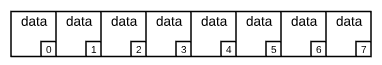

### Asymptotic Complexity
- Insert\Delete:  "O(n)")
- Search:  "O(n)")
- Enumerate:  "O(n)")

### Advantages
- *Access By Index*: Arrays are the only data structure capable of accessing
    items by index in  "O(1)").
    The memory address of any item is easily calculable by summing the base
    address and the product of the desired index and item size.
- *Memory*: Zero overhead required. The total size of an array is the sum of all
    its items.
- *Cache Optimized*: Guaranteed to have optimal [spatial
    locality](https://en.wikipedia.org/wiki/Locality_of_reference) which can
    have profound performance implications. See the [Memory
    Cache](../memory_cache/) section for more details.
- *Maintains Order*: Maintains the order in which items are inserted

### Disadvantages
- *Insert\Delete*: Inserting\Deleting a item requires a different sized
    contiguous section of memory. Therefore, a new section of memory must be
    allocated and existing items must be copied into the newly allocated area.
- *Search*: The only way to search an array is to start at the first item and
    examine each item individually.

## Sorted Arrays
#data_structure, #list

A sorted array has considerably more utility than a standard array. Because of
this, [sorting algorithms](../sorting) are one of the most scrutinized areas of
computer science. Sorted arrays are an excellent option in cases where the data
is well defined and does not require inserts and deletes. Insert and delete
operations are especially onerous because they require a complete rearrangement
of data in memory. Sorting an array enables all of these extra abilities:

1. Min - Find the minimum value in the array
1. Max - Find the maximum value in an array
1. Predecessor - Find the item directly before an arbitrary item
1. Successor - Find the item directly after an arbitrary item
1. Rank - Find the rank of any specific item

In addition to the added utility, search operations go from linear to
logarithmic time. That's a considerable gain. The efficiency is achieved by
using a special algorithm called *binary search* that only works on sorted
content. This is an important algorithm to understand because of it's ubiquity.
Binary Search is the only operation for which pseudo code is provided because
the rest are fairly self explanatory by pursuing the provided source code.

```
binary_search:
    A = starting point of an array
    value = value to search for
    n = number of items to search

    if n <= 0:
        return NOT FOUND

    half = floor of n / 2

    if A[half] equals value:
        return A[half]

    if value is greater than A[half]
        return binary_search(A[half + 1], n - half - 1)

    // if it isn't greater or equal, it must be less than
    return binary_search(A[0], half)
```

### Asymptotic Complexity
- Search: )
- Enumerate:  "O(n)")
- Min: ) 
- Max: ) 
- Predecessor: )
- Successor: )
- Select: ) 
- Rank: )

### Advantages
- *Array Advantages*: All of the advantages of standard arrays
- *Search*: Optimized for quick search operations
- *Utility*: Many useful operations beyond standard arrays

### Disadvantages
- *Insert\Delete*: Virtually unsupported because the array would either need to
    be resorted, or all the items would need to be shifted in memory.
- *Sort Time*: The fastest an array can be sorted is 
    ).
    This time must be calculated into any algorithm hoping to capitalize on the
    added utility.

## Linked Lists
#data_structure, #list

Linked list is a simple yet powerful data structure. Much like an array, a
linked list is simply a collection of items. The difference is that linked list
items are not stored contiguously in memory. Each item maintains a pointer to
the next item in the list so the items can be located anywhere. This is depicted
graphically below.

#### Linked List
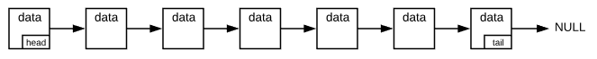

By convention, the first item is the list is known as the *head* and the last
item is known as the *tail*.  There are essentially two types of linked lists:
*singly linked lists* (depicted above) and *doubly linked lists* (depicted
below). As the names imply, singly linked lists maintain a single pointer to the
next item. Doubly linked lists maintain a pointer to the next item as well as a
pointer to the previous item.

#### Doubly Linked List
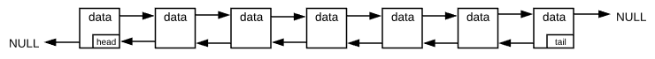

Linked lists are especially helpful for applications such as
[Stack](../stack/)s, and [Queue](../queue/)s.

### Asymptotic Complexity
- Insert\Delete:  "O(1)")
- Search:  "O(n)")
- Enumerate:  "O(n)")

### Advantages
- *Insert\Delete*: Constant time operation
- *Maintains Order*: Maintains the order in which items are inserted

### Disadvantages
- *Memory*: Each item in the list must maintain an additional pointer. The total
    size of a linked list is the sum of the items plus the size of the pointers
    times the number of items.
- *Cache Optimized*: It is possible to create a linked list with poor [spatial
    locality](https://en.wikipedia.org/wiki/Locality_of_reference) which can
    have profound performance implications. See the [Memory
    Cache](../memory_cache/) section for more details.
- *Search*: There is no inherit support for search operations other than
    examining each item individually. Additionally, unlike Arrays, linked lists
    cannot take advantage of [Binary Search](../binary_search), regardless of
    the sort order.

## Binary Trees
#data_structure, #list, #graph

Just like arrays and linked lists, binary trees are another list data structure
(technically, a [graph](../graph_concepts) data structure but graph concepts
aren't germane to this topic). They are the most complex list data structure, so
the reader is highly encouraged to thoroughly examine the provided pseudo and
source code.

As the name implies, binary trees arrange data in a tree like structure with a
root, branches, and leaves. Each node in a binary tree has a left and right
pointer. The left pointer points to a node with a *lesser valued* item and the
right pointer points to a node with a *greater valued* item. Furthermore, every
descendant to the left of a given node has a lesser value and likewise every
descendant to the right has a greater value. The root node can be any node in
the structure and acts as the entry point. The image below depicts a typical
binary tree.

#### Binary Tree
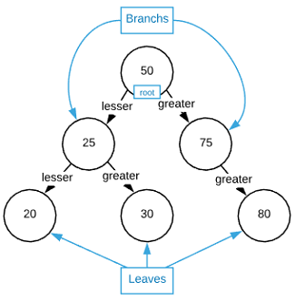

An interesting property of binary trees is that there are multiple valid ways to
rearrange data. For instance, consider the binary trees depicted below. Both
trees are valid, and contain the same data.

#### Same Data, Different Valid Arrangements


Binary trees provide all the same utility as [Sorted Arrays](#sorted-arrays)
with the added bonus of performant insert and deletes. The table below compares
the asymptotic complexity for operations on the two types of data structures. As
is shown, sorted arrays do have slightly faster run times for some operations.
However, if insert and delete is a requirement binary trees are always a better
option.

|Operation  |Sorted Array   | Binary Tree   |
|---|---|---|
|Insert\Delete |)<sup>1</sup> | ) |
|Search |) | ) |
|Enumerate |) |) |
|Min\Max |) |) |
|Predecessor\Successor | ) |) |
|Select |) | ) |
|Rank |) | ) |

<sup>1</sup> While this is technically only a liner run time, array
insert/delete operations require reallocating larger/smaller chunks of memory
and rearranging existing data. Therefore, the constant factors hidden by big O
notation are significant.


As a side note, a more appropriate name may be *inverted* tree because they look
like an upside down tree. Alas, we are bound by convention. Remember the words
of Bertrand Russell, "Conventional people are roused to fury by departure from
convention, largely because they regard such departure as a criticism of
themselves."

### Pseudo Code
```
insert:
    node: tree node to start from
    item: item to insert

    if item is less than node:
        if node->left is NULL:
            node->left = item
            return
        else
            insert(node->left, item)
    else
        if node->right is NULL:
            node->right = item
            return
        else
            InsertNode(node->right, item)

delete:
    node: tree node to start from
    item: item to insert - item will have exactly 0, 1, or 2 children

    if item has 0 children:
        delete pointer to item in parent node
        delete item

    if item has 1 child:
        update item->parent to point to child instead of item
        update child->parent to item->parent
        delete item

    // item has 2 children
    largest_left = largest item in the left subtree
    delete largest_left from tree
    replace item with largest_left

search:
    node: tree node to start from
    item: item to insert - item will have exactly 0, 1, or 2 children

    if item equal node:
        return node

    if item is less than node:
        search(node->left, item)

    // item must be greater than b/c it's not equal or less
    search(node->right, item)

enumerate:
    node: tree node to start from

    enumerate(node->left)
    output node
    enumerate(node->right)

min:
    node: tree node to start from

    if node->left == NULL:
        return node

    return min(node->left)

max:
    node: tree node to start from

    if node->right == NULL:
        return node

    return min(node->right)

predecessor:
    item: item to find predecessor of

    if item->left is not NULL:
        return max(item->left)

    return first parent of item that is less than item

successor:
    item: item to find successor of

    if item->right is not NULL:
        return min(item->right)

    return first parent of item that is greater than item

select:
    node: tree node to start from
    index: index of the item to select

    left = number of items in left subtree

    if left equals index:
        return node

    if index is less than left:
        return select(node->left, index)

    return select(node->right, index - left - 1)

rank:
    node: tree node to start from
    item: item to find rank for
    offset: accumulative offset of the index

    left = number of items in left subtree

    if node equals item:
        return left + offset

    if node < item:
        return rank(node->left, item, offset)

    return rank(node->right, item, offset + left + 1)
    
```

The delete operation in the pseudo code above can be a bit tricky to understand
without a visual. There are three possible paths a delete operation can take:

1. The node to delete has no children (leaf node)
1. The node to delete has a single child
1. The node to delete has two children

The image below depicts each path graphically.

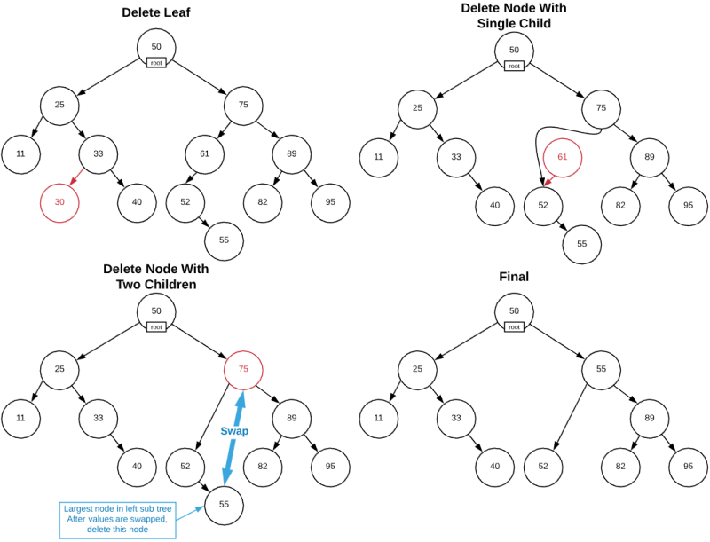

### Asymptotic Complexity
- Insert\Delete: )
- Search: )
- Enumerate: ) 
- Min: )
- Max: )
- Predecessor: )
- Successor: )
- Select: )
- Rank: )

### Advantages
- *Search*: Optimized for quick search operations
- *Insert\Delete*: Although slower then linked list, considerably faster than
    arrays.
- *Utility*: The most utility of any data other list data structure

### Disadvantages
- *Memory*: Each item maintains two additional pointers. The total size of a
    binary tree is the sum of the items plus the size of the pointers times the
    number of items.
- *Cache Optimized*: It is possible to create a binary tree with poor [spatial
    locality](https://en.wikipedia.org/wiki/Locality_of_reference) which can
    have profound performance implications. See the [Memory
    Cache](../memory_cache/) section for more details.
- *Maintains Order*: The order in which items are inserted is lost
- *Complexity*: The most complex list data structure.

## Self Balancing Search Trees
#concept

The previous section on [Binary Trees](#binary-trees) took a few liberties
concerning asymptotic complexity. The purpose was to meter the amount of new
concepts introduced; however, with the introductory concepts out of the way it's
time to correct the oversight.  While most operations were advertised as ), in reality, this is
only true if the tree is perfectly *balanced*. A balanced tree has the same
number of children on either side of each node. A more accurate measure of a
tree's asymptotic complexity is derived from the tree's *height*. The height of
a tree is the number of nodes from the root to the most distant leaf.  See the
image below for a graphical reference.

#### Tree Height
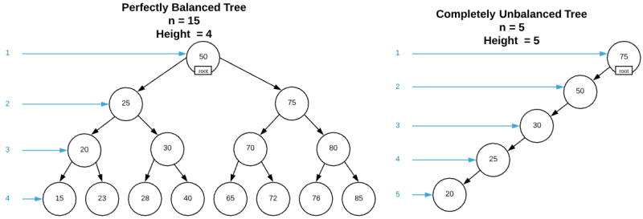

Almost every tree operation requires a tree traversal (see pseudo code below).
Consider how many steps it takes to traverse the trees in the image above. The
unbalanced tree will require five steps. Even though the balanced tree has three
times more nodes, the maximum number of steps to reach any node is four. This
phenomena compounds quickly as more nodes are inserted. It is more accurate to
replace all the )
run times in the previous section with
) because traversing
a completely unbalanced tree is a linear
()) operation.

```
traverse:
    Node = root node of binary tree data structure
    Item = item to search for

    if Node is NULL:
        return NOT FOUND

    if Node->Item is equal to Item:
        return Node

    if Node->Item is greater than Item:
        traverse(Node->Right, Item)

    // If it's not equal or greater, it must be less
    traverse(Node->Left, Item)
```

As is hopefully clear by now, balance is a major concern with trees. Luckily,
there are many tree data structures designed to automatically maintain balance.
These are know as *self balancing search trees*. Examples of such trees include,
but are not limited to:

* Red-black trees
* Splay trees
* AA trees
* AVL trees
* B-trees
* 2-3 trees
* 2-3-4 trees
* Scapegoat trees
* Treaps
* Weight-Balanced trees
* etc...

Many of the examples listed above are simply enhanced binary trees. However,
some are more exotic, such as B-trees which accommodate many keys per node. Each
variation has slightly different run times characteristics and utility. 

This begs the question, if there are trees capable of self balancing, why would
anyone use a standard Binary Tree? The answer is that there is overhead
associated with maintaining balance in the form of both complexity and clock
cycles (see the [Principal of Parsimony](../data_structures)).  Self balancing
ensures optimal tree traversals at the cost of less than optimal update and
insert operations. Therefore, the ratio of insert/delete to traversal operations
is a consideration. In cases where data is inserted in random order,
statistically, a standard binary tree will be balanced regardless.  As with most
cases in computer science, the particular circumstances of individual scenarios
determine the optimal solution. There is no one right answer.

One could write a book solely on tree data structures. In the event that the
reader has an exceedingly performance critical application for trees (perhaps
implementing a database), it's highly recommended that they delve deeper into
this topic. For the majority of applications, the differences are trivial. For
brevity, this source only examines Red-Black trees. Red-Black trees are popular
and the concepts are easily translatable to other tree variations.

## Red-Black Trees
#data_structure, #list, #graph

A red-black tree is an enhanced binary search tree. All of the constraints,
operations, and pseudo code defined in [Binary Tree](#binary-trees) also apply
here. In short, the changes required to make a binary tree a red-black tree are
additive. Valid red-black trees maintain all Binary Tree properties in addition
to the following.

#### Red-Black Tree Properties (aka invariants)
1. Every node is designated as either red or black
1. The root node is always black
1. Red nodes must have black children and parents. Otherwise stated, consecutive
   red nodes are prohibited
1. Every path starting at the root node and ending in a NULL pointer must pass
   through the same number of black nodes (the path that traverse operations
   take through the tree when searching for an item that doesn't exist)

Although it's not entirely intuitive from reading these invariants, maintaining
them ensures that the height of the tree is ).
Consider the simplest possible case: a tree with three node. It's not possible
to arrange the nodes in such a way that it is both unbalanced and also a valid
red-black tree. See the image below (The image does not provide an exhaustive
account of every invalid variation, the reader is invited to extrapolate).

#### Balance and Red-Black Tree Properties
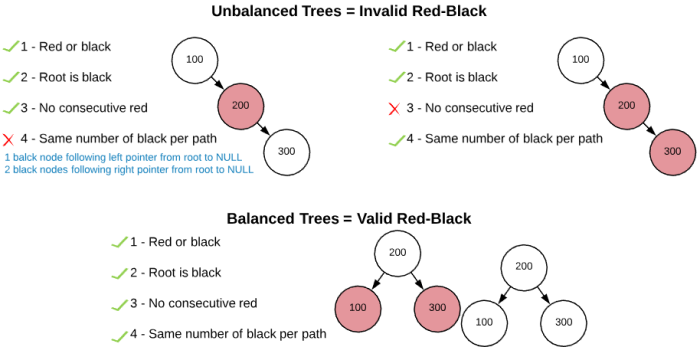

If maintaining red-black tree properties ensures balance, the question becomes
how is it possible to maintain these properties when inserting or deleting
items. The answer is by two primary mechanisms: *recoloring* and *rotation*. The
concept of recoloring is fairly self intuitive: changing the color of a node
from red to black or black to red. Rotations are a more complex topic.
Conceptually, a rotation is rotating a node to change the number of nodes on
either side. The image below depicts the most simple rotation operations
possible.

#### Simple Tree Rotations
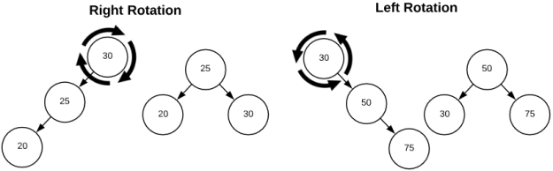

Of course, things get more complicated when there are child nodes. Consider the
rotation depicted in the image below. The red arrows represent pointers that
will be deleted and the blue arrows represent pointers that will be added.

#### Left Rotation
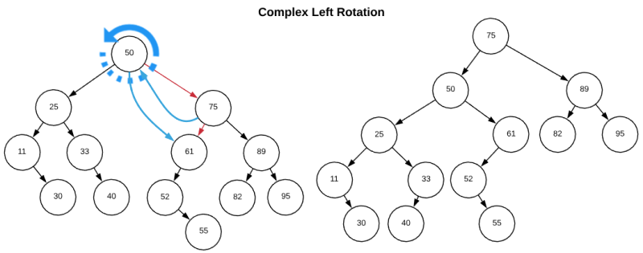

In order to rotate the root node (50) to the left, three things must happen:

1. The parent of the rotation node (50) becomes the parent of the right node
   (75). In this case, NULL.
1. The rotation node's (50) right pointer is updated to the right node's left
   pointer
1. The right node's (75) left pointer changes to the rotation node (50)

A similar process occurs when rotating right. In this example, a branch node
(75) is rotated. Consult the image below.

#### Right Rotation
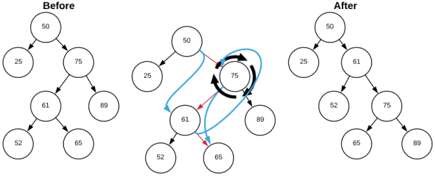

Much like a left rotation, three things happen in a right rotation.

1. The parent (50) of the rotation node (75) becomes the parent of the left node
   (61).
1. The rotation node's (75) left pointer is updated to the left node's right
   pointer (NULL)
1. The left node's (61) right pointer changes to the rotation node (75)

With the preliminary concepts out of the way, it's finally time to consider an
actual a red-black tree insert operation. There are four primary steps:

#### Red-Black Insert at a High Level
1. Insert using the Binary Tree insert algorithm
1. Color the new node red
1. If the new node's parent is black, no invariants are broken so terminate
1. Restore red-black tree invariants

The first three steps are self-explanatory while the fourth is fairly complex;
therefore, it is the focus for the remainder of this section. Restoring the
red-black invariants is a recursive process starting at the inserted node. Below
is an outline for the algorithm.

1. Parent is black
    * terminate
    * if root is red, recolor to black
1. Uncle is red
    * recolor parent black
    * recolor uncle black
    * recolor grandparent red
    * recurse on grandparent
1. Uncle is black or NULL
    * parent is a left branch
        - node is a right branch
            * rotate parent left
            * recurse on parent
        - node is a left branch
            * change parent color to black
            * change grandparent color to red
            * rotate grandparent right
            * recurse on node
    * parent is a right branch or NULL
        - node is a left branch
            * rotate parent right
            * recurse on parent
        - node is a right branch
            * change parent color it black
            * change grandparent color to red
            * rotate grandparent left
            * recurse on node

Don't worry if this seems a bit overwhelming. It's normal to review red-black
tree insertions several times before comprehension sets in. It's also difficult
to fathom without a concrete example. The image below steps through the process
graphically.

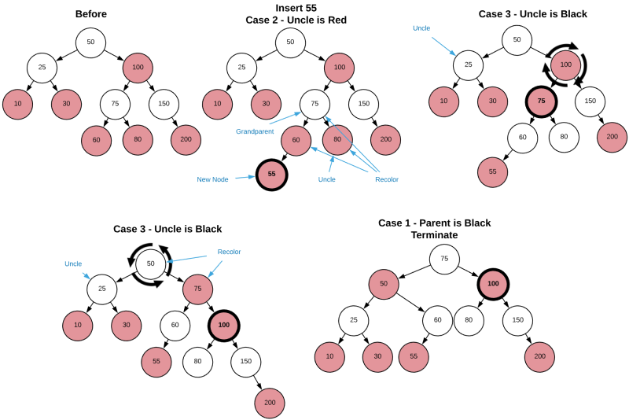

In order to keep these concepts as accessible as possible, a few abstruse
details were omitted. However, the pseudo code as well as accompanying source
code are rigorously complete and should be studied assiduously. With a firm
understanding of the red-black trees from a conceptual level, understanding the
code should be trivial. Additionally, there are no details of deletions are
provided. The reader is encouraged to implement delete on their own.

### Pseudo Code
```
global variables:
    NULL_NODE = black tree node - replaces all NULL parents and leafs. This
        simplifies the algorithm

insert:
    T = binary tree
    new_node = node to insert into the tree

    binary tree insert (see binary tree pseudo code)
    new_node->left = NULL_NODE
    new_node->right = NULL_NODE
    new_node->color = red

    node = new_node
    while new->node->parent == red:
        if node->parent == node->grandparent->left:
            uncle = node->grandparent->right
            if uncle->color == red:
                uncle->color = black
                node->parent->color = black
                node->grandparent->color = red
                node = node->grandparent
            else if node = node->parent->right
                node = node->parent
                left_rotate(node)
            else
                node->parent->color = black
                node->grandparent->color = red
                right_rotate(node->grandparent)
        else
            uncle = node->parent->parent->left
            if uncle->color == red:
                uncle->color = black
                node->parent->color = black
                node->grandparent->color = red
                node = node->grandparent
            else if node = node->parent->left
                node = node->parent
                left_rotate(node)
            else
                node->parent->color = black
                node->grandparent->color = red
                left_rotate(node->grandparent)

    T->root->color = black        
```

### Asymptotic Complexity
- Insert\Delete: )
- Search: )
- Enumerate: ) 
- Min: )
- Max: )
- Predecessor: )
- Successor: )
- Select: )
- Rank: )

### Advantages
- *Binary Tree*: Because a red-black tree is essentially an enhanced binary
    tree, it has the same advantages.
- *Search*: Optimized for quick search operations. Guaranteed to remain balanced
    regardless of insertion order.

### Disadvantages
- *Binary Tree*: Because a red-black tree is essentially an enhanced binary
    tree, it has the same disadvantages.
- *Complexity*: Added complexity beyond Binary Trees.

## Actual Run Times

The actual run times for performing operations on list data structures are shown
below.  For details about how the calculations were run, see
[compare_times.py](c/compare_times.py) and [algo_timer.c](c/algo_timer.c). To
recreate the data on your machine, navigate to the c directory and execute the
[time_charts.sh](../../time_charts.sh) bash file located in the root directory.

### Insert

The following chart and table show the actual run times for `n` insert operation
on the specified data structures.

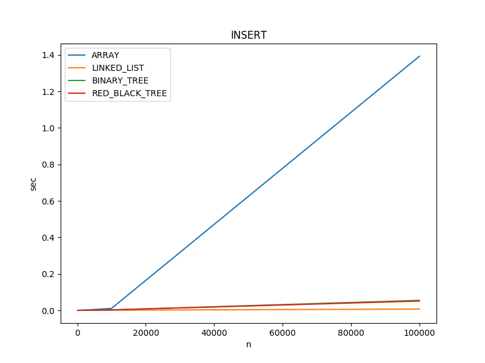

|STRUCTURE|n=100 |n=1000 |n=10000 |n=100000 |
|--|--|--|--|--|
|ARRAY |0.000012 sec|0.000074 sec|0.005261 sec|0.890071 sec|
|LINKED_LIST |0.000005 sec|0.000047 sec|0.000451 sec|0.004580 sec|
|BINARY_TREE |0.000007 sec|0.000094 sec|0.001416 sec|0.025229 sec|

Key Takeaways:
* Inserting 100,000 items into a array is approximately a half to three
    quarters of a second slower than inserting the same items into a linked
    list.
* *Caveat*: For this demo, the new item is inserted at the head of the array.
    Inserting an item into the tail of an array *may* be dramatically faster
    (possibly even faster than linked lists) depending on the language and the
    contents of memory. The interested reader should study the internal working
    of `malloc` to fully understand this.  [Click
    Here](https://danluu.com/malloc-tutorial/) for a decent introduction.

### Search

The following chart and table show the actual run times for `n` search
operations on a data structure with `n` items.

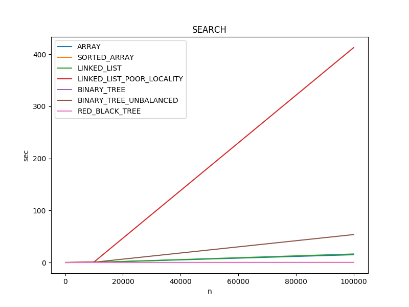

|STRUCTURE|n=100 |n=1000 |n=10000 |n=100000 |
|--|--|--|--|--|
|ARRAY |0.000034 sec|0.003165 sec|0.148806 sec|15.389051 sec|
|LINKED_LIST |0.000016 sec|0.002385 sec|0.196797 sec|16.685011 sec|
|LINKED_LIST_POOR_LOCALITY |0.000019 sec|0.004976 sec|1.014671 sec|420.594918 sec|
|BINARY_TREE |0.000006 sec|0.000077 sec|0.001221 sec|0.022148 sec|
|BINARY_TREE_UNBALANCED |0.000044 sec|0.004681 sec|0.456133 sec|43.199407 sec|

Key Takeaways:
* As predicted, searching a balanced BINARY_TREE is lighting fast.
* BINARY_TREE_UNBALANCED negates the advantages of the binary search algorithm
* LINKED_LIST_POOR_LOCALITY has the worst performance by far and it demonstrates
    the performance implications of not being able to take advantage of the
    cache. Repeatedly accessing memory that is not stored contiguously in memory
    causes cache misses, which are expensive.

### Enumerate

The following chart and table show the actual run times for enumerating `n`
items from the specified data structures.

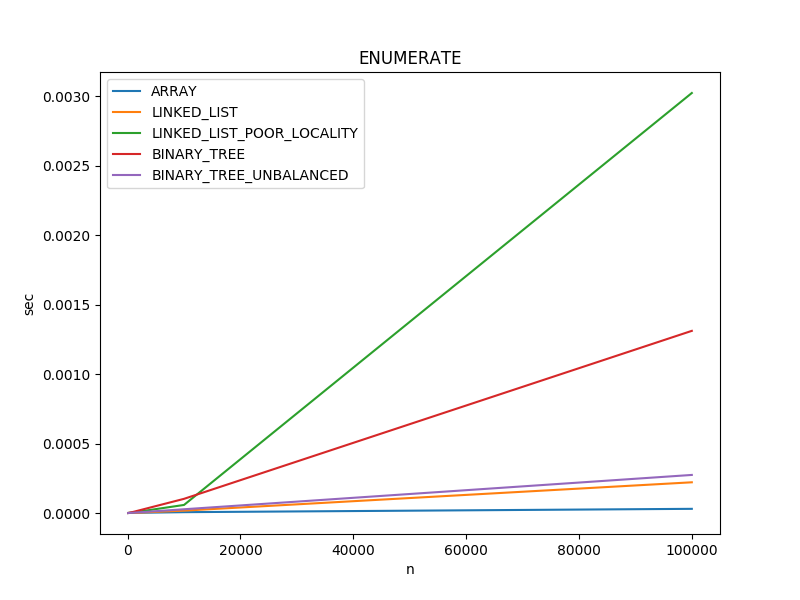

|STRUCTURE|n=100 |n=1000 |n=10000 |n=100000 |
|--|--|--|--|--|
|ARRAY |0.000001 sec|0.000002 sec|0.000007 sec|0.000031 sec|
|LINKED_LIST |0.000001 sec|0.000002 sec|0.000018 sec|0.000222 sec|
|LINKED_LIST_POOR_LOCALITY |0.000001 sec|0.000005 sec|0.000059 sec|0.003024 sec|
|BINARY_TREE |0.000001 sec|0.000009 sec|0.000103 sec|0.001312 sec|
|BINARY_TREE_UNBALANCED |0.000001 sec|0.000003 sec|0.000028 sec|0.000275 sec|

Key Takeaways:
* There is less than .002 seconds difference between each data structure over
    100,000 items.
