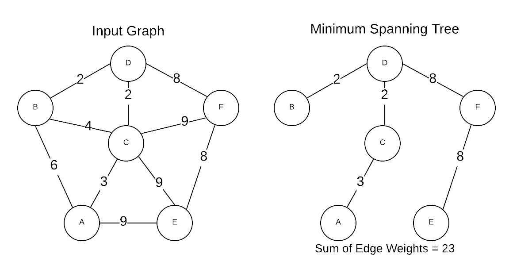

# Minimum Spanning Trees (MST)
Prerequisite: [Graph Concepts](../graph_concepts)

A Minimum Spanning Tree (MST) is the cheapest set of edges that connect graph
vertices together. For instance, servers on a network or destinations on a road
map. Stated differently, an MST is the sub-set of edges with the minimum
possible sum of edge weights. A MST must satisfy two properties.
1. Does not contain a cycle
1. A path exists between every pair of vertices

Based on the definition of a MST, the following facts logically apply:
- All connected graphs have at least one MST
- There are often multiple valid MSTs for a given graph
- An MST has  edges. 

The image below is a graphical representation of an input graph and its MST.



## Prim's Algorithm
Named after Robert C. Prim who discovered the algorithm in 1957. However, it was
discovered that Vojtěch Jarník discovered it in 1930, so it is sometimes know as
the Prim-Jarník algorithm.

### Asymptotic Time Complexity
\log&space;n))

### Pseudo Code

#### Naive Implementation
The pseudo code below is a particularly slow implementation
()) of Prim's algorithm.
However, this simple implementation makes the algorithm easy to understand.

```pseudo
G = connected, undirected graph
T = empty set (will contain edges in MST)
cost = 0

find_smallest:
    G = input graph
    smallest = NULL

    // Loop through each edge where tail vertex is conquered and head vertex is not conqured
    for each vertex (v) in G where v is conquered:
        for each edge in v where edge->head is NOT conquered:
            if smallest is NULL OR edge->weight < smallest->weight:
                smallest = edge

    return smallest

mark first vertex conquered

e = find_smallest G
while e != NULL:
    add e to T
    cost += e->weight
    mark e->head conquered
    edge = find_smallest G

return T and cost
```

#### Heap-Based Implementation
Prerequisite: [Heap](../data_structures/#heap)

This version is more complex, but results in a considerably faster run time
(\log&space;n)))

Invariants:
- Heap contains vertices that have that have not yet been spanned
- Highest priority element in the heap is the next vertex to be conquered

``` pseudo
G = connected, undirected graph
T = empty set (will contain edges in MST)
H = empty heap
cost = 0

find_winning_edge:
    edges = edges to search

    return cheapest edge where head is conquered
    return NULL if no edges qualify

mark first vertex conquered

for v that is not conquered:
    winner = find_winning_edge v->edges
    if winner is NULL:
        score = infinity
    else
        score = winner->weight

    add v to H using score as the heap key value
        
while H is not empty:
    v = extracted min from H

    mark v as conquered
    cost += v.score
    add winner to T (calculated in previous loop)

    for every edge in v where the head is not conquered:
        winner = cheapest edge in edge->head->edges
        if winner is NULL:
            score = infinity
        else
            score = winner->weight

        recacluate H for winner->head

return T cost
```

## Kruskal's Algorithm
Discovered in 1956 by Joseph B. Kruskal. This algorithm has a close association
with _clustering_ algorithms. Clustering is a form of unsupervised learning that
extracts patterns from unlabeled data. While Prim's algorithm is a bit easier to
implement, Kruskal's algorithm has the added benefit of being able to calculate
the MST for a graph that is too large to fit in a single memory space. 

### Asymptotic Time Complexity
\log&space;n))

#### Naive Implementation
Prerequisite: [Graph Search](../graph_search)

The pseudo code below is a particularly slow implementation
()) of Kruskal's algorithm.
However, this simple implementation makes the algorithm easy to understand.

``` pseudo
G = connected, undirected graph
MST = empty graph (will contain edges in MST)
E = array to hold sorted edges

All add vertices in G to MST
Add all edges in G to E
Sort E by weight in ascending order

// see BFS and DFS in Graph Search section
creates_cycle:
    G = graph to search
    v = starting vertex
    w = end vertex

    if graph search from v-> w == not found:
        return false
    else
        return true

for each edge in E:
    // Once we have n-1 edges, the MST is complete
    if MST->m == (G->n - 1):
        break
    if creates_cycle MST e->tail e->head:
        continue to next edge
    add e to MST

return MST
```

#### Union-Find-Based Implementation
Prerequisite: [Union-Find](../data_structures/#union-find)

This version is more complex, but results in a considerably faster run time
(\log&space;n)))

Invariants:
- Union-Find (`U`) data structure represents all [connected
    components](../graph_concepts/#connected-components-undirected) that have
    been added to the MST (`T`)

``` pseudo
G = connected, undirected graph
T = empty set (will contain edges in MST)
E = array to hold sorted edges
U = Empty Union-Find Data Structure

Initialize U with all vertices in G
Add all edges in G to E
Sort E by weight in ascending order

for each edge in E:
    // Once we have n-1 edges, the MST is complete
    if |T| == (G->n - 1):
        break
    // If a cycle is detected, move the next edge
    if U->find e->tail == U->find e->head:
        continue to next edge
    else
        U->union e->head e->tail
        add e to T

return T
```
