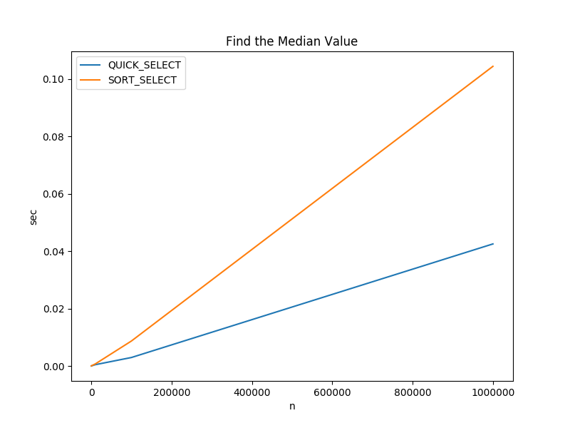
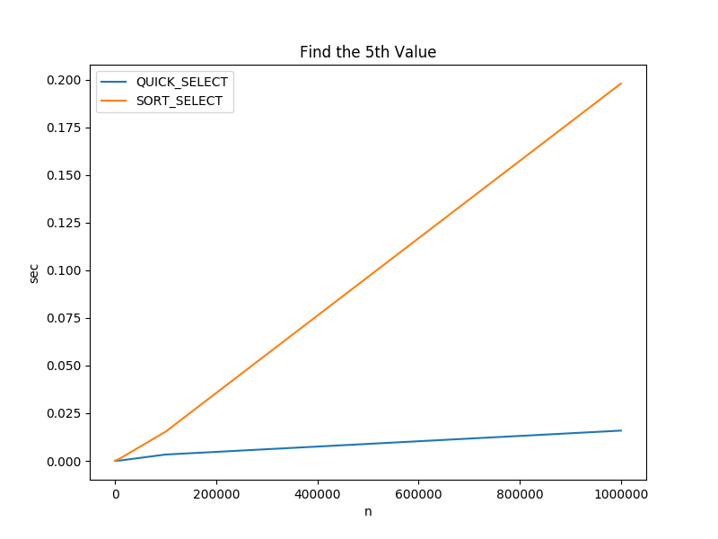
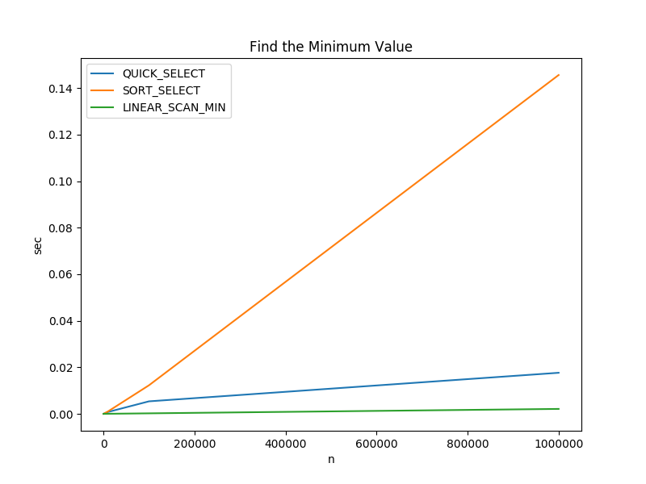

# Quick Select

Quick select determines the n<sup>th</sup> ranked item in an array without
sorting the array. This is accomplished by recursively partitioning halves of
the array until the n<sup>th</sup> item is placed in the correct position. A
typical use is finding the n<sup>th</sup> highest score in an array.

## Actual Run Times

The actual run times for finding the &ast;median and 5<sup>th</sup> highest
value in an integer array using the C implementation of the quick select
algorithm and C's qsort are shown below.

 

|ALGORITHM| n=100 |n=1000 |n=10000 |n=100000 |n=1000000 |
--|--|--|--|--|--|
|QUICK_SELECT |0.000006 sec|0.000026 sec|0.000196 sec|0.003316 sec|0.015870 sec|
|SORT_SELECT |0.000008 sec|0.000159 sec|0.001267 sec|0.015303 sec|0.197968 sec|

&ast; For the purposes of this project, median is defined as simply the
n/2<sup>th</sup> element.  Technically, if the array is odd sized, it should be
the average of the middle two elements. A somewhat pedantic point, but it may be
important in some contexts.

 

|ALGORITHM| n=100 |n=1000 |n=10000 |n=100000 |n=1000000 |
--|--|--|--|--|--|
|QUICK_SELECT |0.000006 sec|0.000026 sec|0.000196 sec|0.003316 sec|0.015870 sec|
|SORT_SELECT |0.000008 sec|0.000159 sec|0.001267 sec|0.015303 sec|0.197968 sec|

For the maximum/minimum value in an array, it's possible to do a simple linear
scan while keeping track of the highest/lowest value. The result is shown below.

 

|ALGORITHM| n=100 |n=1000 |n=10000 |n=100000 |n=1000000 |
--|--|--|--|--|--|
|QUICK_SELECT |0.000005 sec|0.000018 sec|0.000492 sec|0.002872 sec|0.020482 sec|
|SORT_SELECT |0.000009 sec|0.000113 sec|0.001254 sec|0.015291 sec|0.179286 sec|
|LINEAR_SCAN_MIN |0.000001 sec|0.000003 sec|0.000027 sec|0.000256 sec|0.002649 sec|

Key Takeaway: 
- *Quick Select* and *Linear Scan* are both O(n) algorithms. Obviously, they do
not have the same actual run times. It's important to understand that the
purpose of asymptotic time complexity is to demonstrate how the run time of an
algorithm increases as the input size increases.  It is not the only run time
consideration.

For details about how the calculations were run, see
[compare_times.py](c/compare_times.py) and [algo_timer.c](c/algo_timer.c). To
recreate the data on your machine, navigate to the c directory and execute the
[time_charts.sh](c/time_charts.sh) bash file.

### Asymptotic Time Complexity
O(n) *on average*


### Pseudo Code
``` pseudo
select:
    // side effect: rearranges the values in A, the correct value will be in the
    // nth position of the array
    A = input array
    nth = the nth highest value to find

    if length of A <= 1:
        return A[0]

    pivot_on = choose_pivot(n)
    swap A[0] with A[pivot_on]

    pivot = partition(nth, A)

    if pivot == nth:
        return A[nth]

    if pivot < nth:
        return select(nth - pivot, A[pivot thru len of A])

    return select(nth, A[0 thru pivot])
    
partition:
    A = input array with the pivot value at position 0

    pivot_pointer = A[0]
    left_pointer = A[1]
    right_pointer = A[last item]

    infinite loop:
        while
            left_pointer < right_pointer and
            left_pointer value < pivot_pointer value:

                left_pointer + 1

        while
            right_pointer is not the begining of the array and
            right_pointer value >= pivot_pointer value:

                right_pointer + 1

        if left_pointer >= right_pointer:
            break out of infinite loop
        else
            swap left_pointer value with right_pointer value

    swap pivot_pointer value with right_pointer value
    return right_pointer

choose_pivot:
    returns: ideal index to partition on
    n = number of elements in the partition

    return uniformly random number between 0 and n inclusive
```
