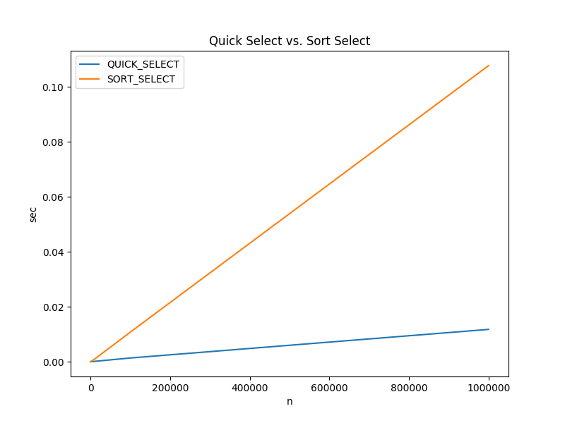

# Quick Select

Quick select determines the nth ranked item in an array without sorting the
array. This is accomplished by recursively partitioning halves of the array
until the nth item is placed in the correct position. A typical use is finding
the nth highest grade in an array.

In the case of finding the highest/lowest value in an array, a simple liner
array scan will be slightly more efficient.

## Actual Run Times

The actual run times for finding the 5th highest value in an integer arrays
using the C implementation of the quick sort algorithm and C's qsort built in
sorting function are shown below.

All data was collected using a docker container running on a Surface Book 2
Laptop (Intel Core i7, 16GB RAM).  Each time value represents the median of 3
separate executions. For details about how the calculations were run, see
[compare_times.py](c/compare_times.py) and [algo_timer.c](c/algo_timer.c). To
recreate the data on your machine, navigate to the c directory and execute the
[time_charts.sh](c/time_charts.sh) bash file.

 

|ALGORITHM| n=100 |n=1000 |n=10000 |n=100000 |n=1000000 |
--|--|--|--|--|--|
|QUICK_SELECT |0.000003 sec|0.000028 sec|0.000073 sec|0.002056 sec|0.011387 sec|
|SORT_SELECT |0.000007 sec|0.000060 sec|0.000740 sec|0.009913 sec|0.105244 sec|


### Asymptotic Time Complexity
O(n) *on average*


### Pseudo Code
``` pseudo
select:
    // side effect: rearranges the values in A, the correct value will be in the
    // nth position of the array
    A = input array
    nth = the nth highest value to find

    if length of A <= 1:
        return A[0]

    pivot_on = choose_pivot(n)
    swap A[0] with A[pivot_on]

    pivot = partition(nth, A)

    if pivot == nth:
        return A[nth]

    if pivot < nth:
        return select(nth - pivot, A[pivot thru len of A])

    return select(nth, A[0 thru pivot])
    
partition:
    A = input array with the pivot value at position 0

    pivot_pointer = A[0]
    left_pointer = A[1]
    right_pointer = A[last item]

    infinite loop:
        while
            left_pointer < right_pointer and
            left_pointer value < pivot_pointer value:

                left_pointer + 1

        while
            right_pointer is not the begining of the array and
            right_pointer value >= pivot_pointer value:

                right_pointer + 1

        if left_pointer >= right_pointer:
            break out of infinite loop
        else
            swap left_pointer value with right_pointer value

    swap pivot_pointer value with right_pointer value
    return right_pointer

choose_pivot:
    returns: ideal index to partition on
    n = number of elements in the partition

    return uniformly random number between 0 and n inclusive
```
