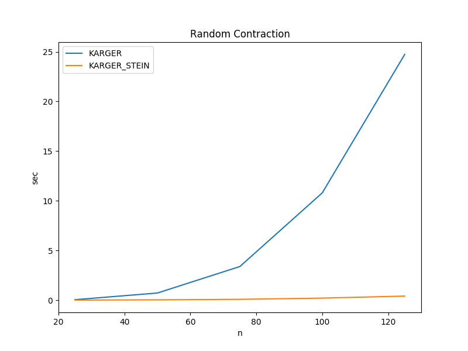

# Random Contraction
#graph, #randomized, #divide-and-conquer

Prerequisite: [Graph Concepts](../graph_concepts)

The random contraction algorithm finds the [minimum
cut](../graph_concepts/README.md#minimum-cut) of a graph by randomly contracting
edges until only two vertices remain (see pseudo code).  Because a minimum cut
has fewer edges than a non-minimum cut, the algorithm has a higher probability
of producing a minimum cut than a non-minimum cut. The key concept here is that
it has a *higher probability* of producing a minimum cut: it is not guaranteed
to produce one.

The probability that random contraction produces a minimum cut is
}). In order to
ensure that a minimum cut is produced, the algorithm should be run  times. The
smallest minimum cut found over all executions  has a high probability of being
an actual minimum cut.

The algorithm as described above is known as the Karger random contraction
algorithm. The Karger-Stein random contraction algorithm significantly improves
the runtime by decreasing the number of iterations required to produce a minimum
cut with a high probability of correctness. The basic concept is that the
probability of collapsing an incorrect edge gets higher as the number of edges
decreases. Thus reducing the number of edges to  and
reusing the pre-reduced result greatly reduces the number of required
iterations. This is much easier to grasp by examining the pseudo code.

## Asymptotic Time Complexity

* Karger: )
* Karger-Stein: )

## Pseudo Code

``` pseudo
karger:
    G = input graph
    returns: minimum cut found over n^2 log n iterations

    min_cut = G

    repeat n^2 log (n) times:
        temp = copy of G

        while temp->n > 2:
            collapse random edge

        if min_cut < temp:
            min_cut = temp

   return min_cut

karger-stein-recursive:
    G = input graph
    returns: minimum cut

    if n <= 6:
        return karger(G)

    t = n + 1 / square root 2
    while n > t:
        collapse random edge

    G1 = karger-stein-recursive(G)
    G2 = karger-stein-recursive(G)

    return the min of G1 and G2

karger-stein:
    G = input graph
    returns: minimum cut found over n*log n / n - 1 iterations

    min_cut = G

    repeat n*log n / n-1  times:
        temp = karger-stein-recursive(G)

        if min_cut < temp:
            min_cut = temp

   return min_cut
```

## Actual Run Times

The actual run times for finding the minimum cut of a randomly generated graph
are shown below.  For details about how the calculations were run, see
[compare_times.py](c/compare_times.py) and [algo_timer.c](c/algo_timer.c). To
recreate the data on your machine, navigate to the c directory and execute the
[time_charts.sh](c/time_charts.sh) bash file.

 

|ALGORITHM| n=25,m=250 |n=50,m=500 |n=75,m=750 |n=100,m=1000 |n=125,m=1250 |
--|--|--|--|--|--|
|KARGER |0.053415 sec|0.722489 sec|3.389049 sec|10.802166 sec|24.735355 sec|
|KARGER_STEIN |0.009551 sec|0.037323 sec|0.089343 sec|0.210117 sec|0.416360 sec|

Key Takeaways:
- A probabilistic algorithm can be run multiple times to achieve a higher
    probability of success.
- By increasing the probability of producing the correct answer on each
    iteration, the total number of iterations is decreased. This results in HUGE
    overall run time savings.
