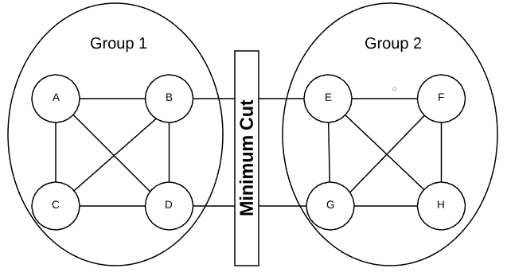

# Random Contraction
#graph, #randomized

Prerequisite: [Graph Concepts](../graph_concepts)

The random contraction algorithm finds the *minimum cut* of a graph. The minimum
cut is the grouping of vertices into two non-empty groups having the fewest
number of crossing edges. Consider the graph in the graphic below.  There is no
other way of dividing the vertices that world result in fewer crossing edges.

### Minimum Cut

In an undirected graph, a crossing edge is considered any edge that has an end
point in both groups. A crossing edge in a directed graph is when an edge has a
tail in group 1 and a head in group 2.

I don't understand this...
Watch counting minimum cuts again
what is the largest number of min cuts that a graph with n vertices can have The
lower bound is 
or }{2}) minimum
cuts in a graph.

Probability of success is 

Must run multiple times to get a resonable proablity of success

N = number of trails needed

n^2 trails produces ~1/3 probablity of failure

n^2 lnn = 1/n failures proablabity

## Asymptotic Time Complexity

)

## Pseudo Code

Inputs: [Adjacency List](../graph_concepts/README.md#adjacency-list)
representing an undirected graph (parallel edges allowed)

Output: Minimum Cut

while n > 2:
    pick edge at random
    merge end into single vertex
    remove self loops

return cut represented by final 2 vertices

I'm code

## Common Uses

* Reliability Analysis: Consider a network graph. The minimum cut represents the
    minimum number of failures that will cause a outage.
* Social Networking: Identify sub-cultures by finding portions of the graph that
    are highly interconnected yet weakly connected to the graph as a whole
* Image Segmentation: Pixels are vertices and edges are defined by adjacency.
    Edge weight is the difference between pixel colors. Minimum cuts should be
    able to isolate individual objects in the picture.
