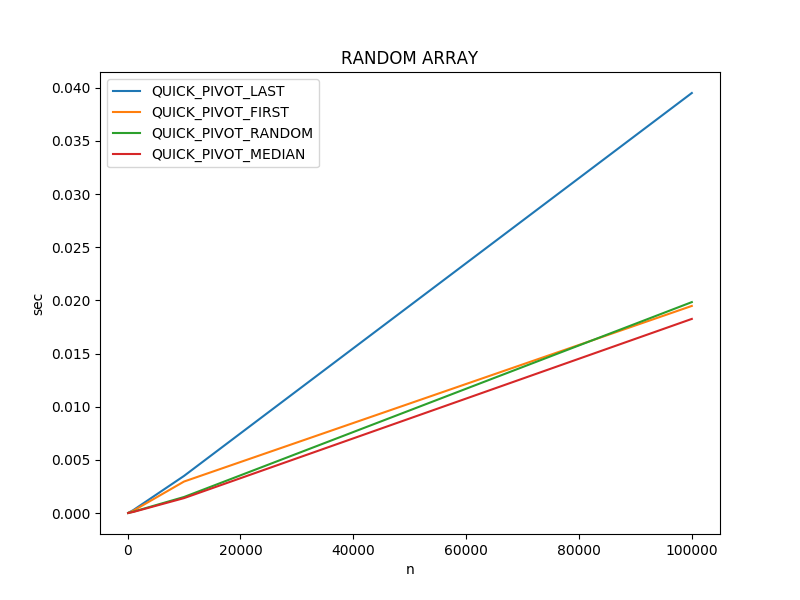
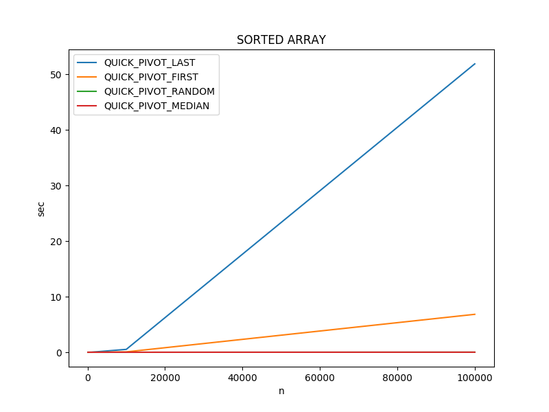
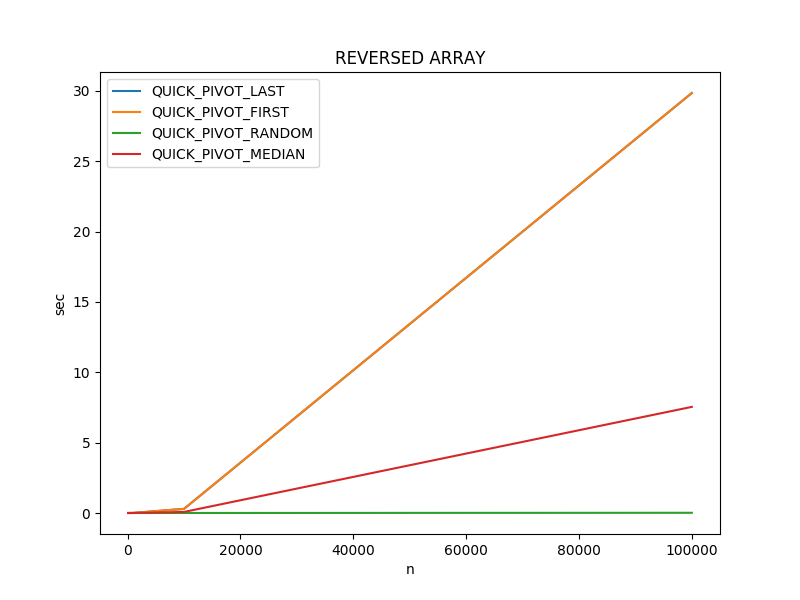
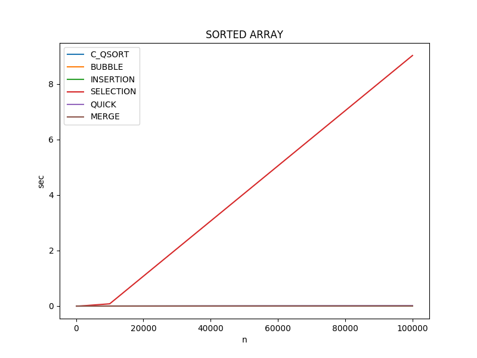
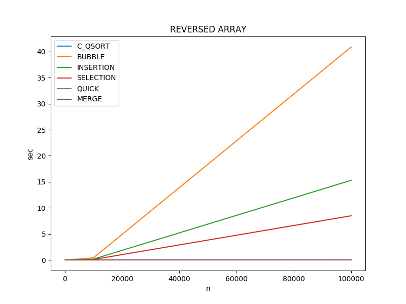

# Sorting

Typically, formal algorithm courses begin with sorting b/c they provide an easy
foundation for which to teach the fundamental concepts of asymptotic time
complexity. It seems fitting to group all these algorithms into a single section
in order to easily compare and contrast them. This section covers 5 different
algorithms:

1) [Bubble Sort](#bubble-sort)
1) [Insertion Sort](#insertion-sort)
1) [Selection Sort](#selection-sort)
1) [Merge Sort](#merge-sort)
1) [Quick Sort](#quick-sort)

## Bubble Sort
#sorting

Bubble sort is the easiest to implement but is typically a poor performer when
the values in the input array are randomly sorted. At the extremes, bubble sort
performs better than all other sorting algorithms when the input is pre-sorted
and worst than all others when the input is reverse sorted.

### Asymptotic Time Complexity
 "O(n^2)")

### Pseudo Code

``` pseudo
sort:
    // side effect: rearranges the values in A
    A = input array
    
    unsorted_to = num items in A - 1
    sorted = false
    
    while sort is false:
        sorted = true

        for i = 0 to unsorted_to:
            if (A[i] > A[i + 1]:
                swap A[i] and A[i+1]
                sorted = false

         usorted_to -= 1
```

## Insertion Sort
#sorting

Like bubble sort, insertion sort performs very well when the input is
pre-sorted. However, it performs considerably better than bubble sort when the
input is either randomly or reverse sorted. Although considerably better than
bubble sort, it's performance is still abysmal compared to quick and merge sort
for large inputs.

### Asymptotic Time Complexity
 "O(n^2)")

### Pseudo Code

``` pseudo
sort:
    // side effect: rearranges the values in A
    A = input array

    for i = 0 to num of items in A:
        open_index = i
        temp = A[i]

        for j = i - 1 to 0:
            if temp > A[j]:
                shift A[j] to the right one position
                open_index += 1
            else:
                end inner loop
                
        A[open_index] = temp
```

## Selection Sort
#sorting

Selection sort is essentially the opposite of insertion sort in the way it
works. Insertion starts at the left side of the array and selection starts at
the right. It performs best when the array is reverse sorted. However, it does
not perform well compared to any other algorithm case.

### Asymptotic Time Complexity
 "O(n^2)")

### Pseudo Code

``` pseudo
sort:
    // side effect: rearranges the values in A
    A = input array

    for i = 0 to num of items in A - 1:
        lowest = A[i]

        for j = i + 1 to num of items in A:
            if lowest > A[j]:
                lowest = A[j]

        swap lowest and A[i]
```

## Merge Sort
#sorting, #divide-and-conquer

Merge sort is a classic divide and conquer algorithm. It splits an array in
half, recursively sorts each half, and finally merges them together. This
algorithm has excellent performance but has higher memory usage requirements
because it generates an entirely new array instead of rearranging existing
values.

### Asymptotic Time Complexity
)

### Pseudo Code

``` pseudo
sort:
    A = input array
    returns: New array consisting of sorted values

    if length of A == 1:
        return A

    A1 = first half of A
    A2 = second half of A

    sort(A1)
    sort(A2)

    return merge(A1, A2)

merge:
    A1 = sorted array
    A2 = sorted array
    returns: new array with values merged from A1 and A1

    i = 1
    j = 1

    for k = 1 to n
        if A1[i] < A2[j]
            B[k] = A1[i]
            i++
        else
            B[k] = A2[j]
            j++

    return B
            
```

## Quick Sort
#sorting, #divide-and-conquer, #randomized

Sorting algorithm that is prevalent in practice. Although it has the same
runtime on average as merge sort, it will execute faster due to reduced memory
requirements. Additionally, it is far easier to implement than quick sort.

One important consideration is the implementation of Choose Pivot. Choosing a
pivot element that represents the median value in the array is ideal. However,
the overhead associated with calculating the median renders the approach
ineffective. There are mathematical proofs that demonstrate choosing a pivot
point at random will ensure O(n log(2, n)) on average.

### Asymptotic Time Complexity
) _on average_

### Pseudo Code

``` pseudo
sort:
    // side effect: rearranges the values in A
    A = input array
    n = length of A

    if n <= 1:
        return

    pivot = choose_pivot(n)
    swap A[0] and A[pivot]

    pivot_index = partition(A[0])

    // The array is never copied, all swaps happen in place.
    // Recursive calls pass a reference to a portion of the array.
    sort(A[0 thru pivot_index - 1])
    sort(A[pivot_index + 1 thru n])

partition:
    // side effects:
    // - All items in A that are less than the value at A[0] are before A[return value]
    // - All items in A that are greater than the value at A[0] are moved after A[return value]
    // - The value at A[0] is moved to A[return value]
    // Assumption: A[0] is the value to partition aroundk
    returns: new position of the value at A[0] after the partition
    A = input array
    n = number of elements to partition around

    index = 1
    for i = 1 to n:
        if A[i] < A[0]:
            swap A[i] and A[index]
            increment index

    if index - 1 > 0:
        swap A[0] and A[index]

    return index

choose_pivot:
    returns: ideal index to partition on
    n = number of elements in the partition

    return uniformly random number between 0 and n inclusive
```

### Quick Sort Actual Run Times

One important consideration when implementing quick sort is the choose pivot
algorithm because it has considerable influence on the actual run time. The
charts below show the run times for four different implementations of choose
pivot.

* QUICK_PIVOT_LAST: Always pivot on the last element
* QUICK_PIVOT_FIRST: Always pivot on the first element
* QUICK_PIVOT_RANDOM: Pivot on a random number between 0 and n - 1
* QUICK_PIVOT_MEDIAN: Pivot on the median of the first, last, and middle element

#### Arrays w/ Random Integer Values

 

|ALGORITHM|n=100 |n=1000 |n=10000 |n=100000 |
|--|--|--|--|--|
|QUICK_PIVOT_LAST |0.000018 sec|0.000278 sec|0.003496 sec|0.039498 sec|
|QUICK_PIVOT_FIRST |0.000015 sec|0.000221 sec|0.002966 sec|0.019478 sec|
|QUICK_PIVOT_RANDOM |0.000009 sec|0.000131 sec|0.001513 sec|0.019836 sec|
|QUICK_PIVOT_MEDIAN |0.000008 sec|0.000105 sec|0.001408 sec|0.018257 sec|

Key Takeaways: 
- Their is very little difference but *MEDIAN* wins by a slight margin. The
    difference is small enough that a slightly different arrangement could
    change the result.
- The run time characteristics of *RANDOM* are consistent for all types of
    arrays
    
#### Arrays w/ Pre-Sorted Values

 

|ALGORITHM|n=100 |n=1000 |n=10000 |n=100000 |
|--|--|--|--|--|
|QUICK_PIVOT_LAST |0.000100 sec|0.010064 sec|0.521035 sec|51.889364 sec|
|QUICK_PIVOT_FIRST |0.000010 sec|0.000734 sec|0.067155 sec|6.826175 sec|
|QUICK_PIVOT_RANDOM |0.000008 sec|0.000126 sec|0.001223 sec|0.015780 sec|
|QUICK_PIVOT_MEDIAN |0.000006 sec|0.000067 sec|0.000931 sec|0.010826 sec|

Key Takeaways of pre-sorted arrays: 
- *LAST* takes a whopping 51 seconds.

#### Arrays w/ Reverse Sorted Values

 

|ALGORITHM|n=100 |n=1000 |n=10000 |n=100000 |
|--|--|--|--|--|
|QUICK_PIVOT_LAST |0.000064 sec|0.006450 sec|0.294811 sec|29.853370 sec|
|QUICK_PIVOT_FIRST |0.000031 sec|0.002881 sec|0.294002 sec|29.855214 sec|
|QUICK_PIVOT_RANDOM |0.000008 sec|0.000101 sec|0.001344 sec|0.015160 sec|
|QUICK_PIVOT_MEDIAN |0.000011 sec|0.000773 sec|0.076374 sec|7.544084 sec|

Key Takeaways of reverse arrays: 
- *LAST* and *FIRST* are equally bad
- *MEDIAN* is clearly unacceptable

From this analysis, we can conclude that although *MEDIAN* has a slight edge for
random and sorted arrays, *RANDOM* is the best general purpose option.

## Actual Run Times

The actual run times for sorting various size integer arrays using the C
implementation of the algorithms is shown below. All data was collected using a
docker container running on a Surface Book 2 Laptop (Intel Core i7, 16GB RAM).
Each time value represents the median of 3 separate executions. For details
about how the calculations were run, see [compare_times.py](c/compare_times.py)
and [algo_timer.c](c/algo_timer.c). To recreate the data on your machine,
navigate to the c directory and execute the [time_charts.sh](c/time_charts.sh)
bash file.

### Arrays w/ Random Integer Values

 

|ALGORITHM|n=100 |n=1000 |n=10000 |n=100000 |
|--|--|--|--|--|
|C_QSORT |0.000012 sec|0.000156 sec|0.000924 sec|0.010486 sec|
|BUBBLE |0.000048 sec|0.003869 sec|0.379764 sec|38.650331 sec|
|INSERTION |0.000011 sec|0.000831 sec|0.086706 sec|8.700342 sec|
|SELECTION |0.000013 sec|0.000846 sec|0.082433 sec|7.896328 sec|
|QUICK |0.000024 sec|0.000114 sec|0.001562 sec|0.019407 sec|
|MERGE |0.000007 sec|0.000088 sec|0.001222 sec|0.015161 sec|

Key Takeaways: 
- *Quick*, *Merge*, and *C's qsort* all perform fairly consistently regardless of
    the order of the input array.
- *Bubble*, *Insertion*, and *Selection* perform well when the input size is
    low; however, the run time increases exponentially as the input size
    increases
- *Merge* performs slightly better than *Quick*, however, it has much higher
    memory requirements.
    
### Arrays w/ Pre-Sorted Values

 

|ALGORITHM|n=100 |n=1000 |n=10000 |n=100000 |
|--|--|--|--|--|
|C_QSORT |0.000004 sec|0.000038 sec|0.000471 sec|0.004750 sec|
|BUBBLE |0.000001 sec|0.000004 sec|0.000030 sec|0.000331 sec|
|INSERTION |0.000003 sec|0.000026 sec|0.000255 sec|0.002702 sec|
|SELECTION |0.000019 sec|0.002178 sec|0.080545 sec|7.738967 sec|
|QUICK |0.000008 sec|0.000095 sec|0.001212 sec|0.014143 sec|
|MERGE |0.000004 sec|0.000036 sec|0.000431 sec|0.004937 sec|

Key Takeaways of pre-sorted arrays: 
- *Bubble* clearly performs best
- *Insertion* outperforms *Selection* by a wide margin (opposite of reverse
    sorted results)

### Arrays w/ Reverse Sorted Values

 

|ALGORITHM|n=100 |n=1000 |n=10000 |n=100000 |
|--|--|--|--|--|
|C_QSORT |0.000004 sec|0.000036 sec|0.000420 sec|0.004646 sec|
|BUBBLE |0.000085 sec|0.008056 sec|0.439852 sec|43.008788 sec|
|INSERTION |0.000019 sec|0.001764 sec|0.178411 sec|17.768902 sec|
|SELECTION |0.000010 sec|0.000900 sec|0.079589 sec|8.197930 sec|
|QUICK |0.000008 sec|0.000100 sec|0.001345 sec|0.016872 sec|
|MERGE |0.000004 sec|0.000041 sec|0.000500 sec|0.005606 sec|

Key Takeaways of reverse arrays: 
- *Bubble* is clearly the worst performer
- *Selection* outperforms *Insertion* by a wide margin (opposite of
    pre-sorted results)

